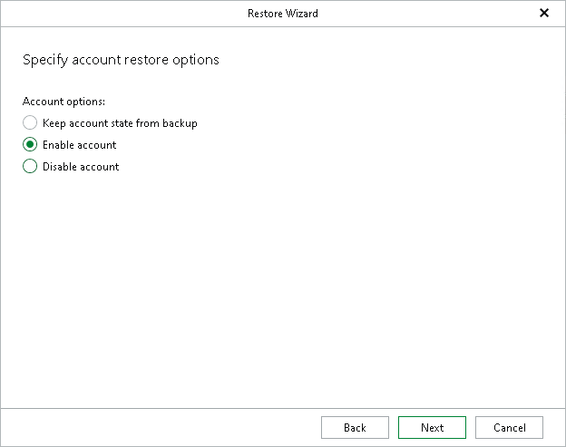

# Step 5. Specify Account State

In this article

At this step of the wizard, select one of the following options:

* Keep account state from backup — to keep the account state as it is in the backup file.
* Enable account — to change the account state to enabled.
* Disable account — to change the account state to disabled.

Page updated 10/6/2025

Page content applies to build 13.0.1.1071
