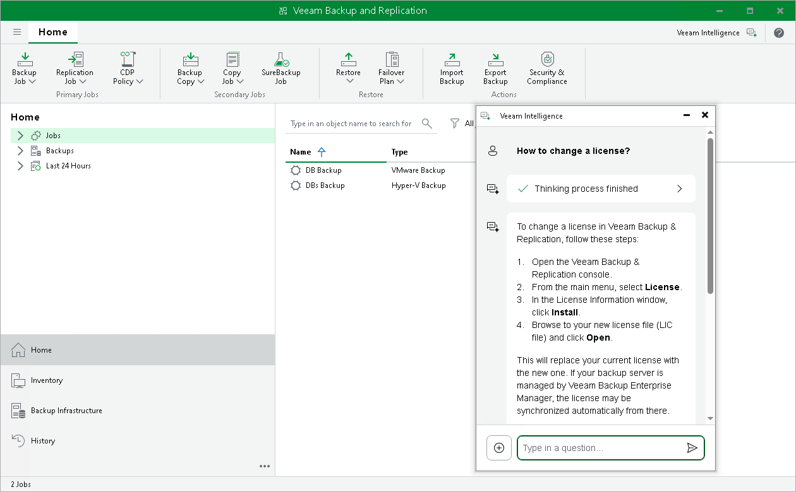

# Veeam Intelligence

Veeam Intelligence is a chatbot designed to assist with common issues and questions about Veeam products. It is trained on Veeam technical documentation to provide accurate answers. You can communicate with Veeam Intelligence in any language and create both simple and complex inquiries.

|  |
| --- |
| Important |
| Consider the following:   * Only the currently installed license is used for authentication. If you change the license, you must close the chatbot window and reopen it. * Do not share confidential information when using Veeam Intelligence as the queries are sent outside your organization. Veeam does not assume responsibility for the accuracy of the information that the chatbot provides. * Veeam Intelligence is updated regularly. For more information on Veeam Intelligence updates, see [this Veeam KB article](https://www.veeam.com/kb4539). |

Veeam Intelligence Limitations

Veeam Intelligence has the following limitations:

* Each license is limited to 200 questions per 24 hours. If you reach this limit, Veeam Intelligence will not process additional queries until the 24-hour period resets.
* The server that runs Veeam Backup & Replication console must have an active internet connection to use Veeam Intelligence.
* You must have a paid license and support contract or an Evaluation license to use Veeam Intelligence. It is not available for Community (free) Edition or NFR licenses.

Veeam Intelligence Modes

Veeam Intelligence operates in one of the following modes: Basic or Advanced. You can choose either mode in the [Veeam Intelligence settings](veeam_intelligence_settings.md) of the Veeam Backup & Replication console.

Basic Mode

In the Basic mode, administrators can submit queries about product functionality. Veeam Intelligence uses an agent-based retrieval mechanism to process these queries. It performs real-time searches across multiple resources, such as Veeam Help Center, Support Knowledge Base (KB) articles, R&D Forums and additional content available on the Veeam website.

This approach ensures that responses are based on the most current and comprehensive information. Unlike static information sources that rely solely on the User Guide, agent-based retrieval provides more accurate and reliable results by gathering information from multiple sources dynamically.

Advanced Mode

The Advanced mode is built upon the Basic mode and uses additional data sources, including backup infrastructure details, workload protection status, and real-time monitoring data. This mode delivers tailored and actionable information.

Advanced mode accesses comprehensive infrastructure data and live operational metrics through Veeam ONE, without the need for installation. These inputs activate specialized AI agents that improve IT teams efficiency, optimize the use of available data, and provide relevant insights without manual report generation.

|  |
| --- |
| Important |
| This mode requires version 13.0.1 or later. |

Using Veeam Intelligence

To start a new conversation:

1. Click the Veeam Intelligence button located in the upper right corner of the Veeam Backup & Replication window.
2. In the chat window, type your question. Consider the following examples:

* How to create a Replication Job?
* Where are Veeam Backup & Replication logs stored?
* How to change license?
* How can I use Veeam Backup & Replication to make sure my VMs are regularly backed up, easily recovered, and securely stored?

You can move the chat window and position it anywhere within the UI. The window remains open alongside any wizard.

1. Click the Send button or press Enter to send your question.
2. To close or minimize Veeam Intelligence , do the following:

* Click Minimize to hide the chatbot window and preserve the conversation in the current session.
* Click the Plus or Close button to delete the conversation and its context.

Replies from Veeam Intelligence are standardized text blocks in the Markdown format. Each answer includes links to relevant Veeam documentation and KB articles. Screenshots and images are not supported.

If the answer is insufficient, add more details to your question. Veeam Intelligence retains the conversation context and previous questions within the current session, so you do not need to repeat information.

|  |
| --- |
| Note |
| If the Veeam Intelligence service becomes overloaded, the question may be canceled. |

Disabling Veeam Intelligence

If you cannot use Veeam Intelligence in your environment due to company policy, security concerns, or any other reasons, you can disable it completely in the Veeam Backup & Replication settings. For details on how to disable Veeam Intelligence, see [Configuring Veeam Intelligence Settings](veeam_intelligence_settings.md).

