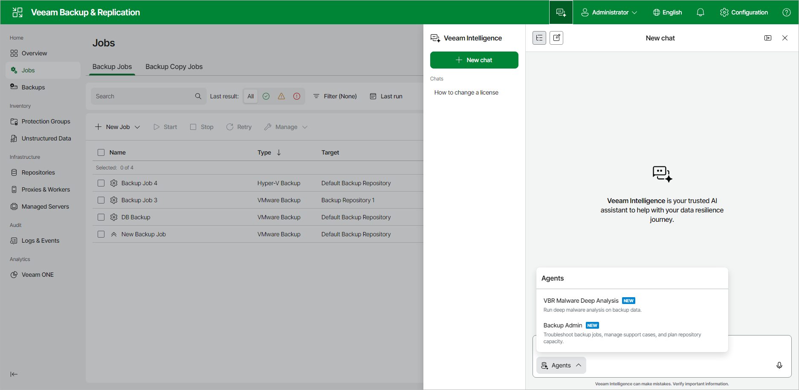

# Working with Veeam Intelligence Using Web UI

Veeam Intelligence is an AI assistant that helps you manage and troubleshoot your backup environment. In addition to answering questions about Veeam products, it can investigate your backup data and perform operations on your behalf, while you retain full control. Veeam Intelligence is trained on Veeam technical documentation to provide accurate answers. You can communicate with Veeam Intelligence in any language and create both simple and complex inquiries.

|  |
| --- |
| Important |
| Consider the following:   * Veeam Intelligence uses only the currently installed license for authentication. If you change the license, you must restart the Veeam Backup & Replication console. * Do not share confidential information when you use Veeam Intelligence, as the queries are sent outside your organization. Veeam does not assume responsibility for the accuracy of the information that the chatbot provides. * Veeam Intelligence is updated regularly. For more information on Veeam Intelligence updates, see [this Veeam KB article](https://www.veeam.com/kb4539). |

Veeam Intelligence Limitations

Veeam Intelligence has the following limitations:

* Each license is limited to 200 questions per 24 hours. If you reach this limit, Veeam Intelligence will not process additional queries until the 24-hour period resets.

* The server that runs Veeam Backup & Replication console must have an active internet connection to use Veeam Intelligence.

* You must have a paid license and support contract or an Evaluation license to use Veeam Intelligence. It is not available for Community (free) Edition or NFR licenses.
* Advanced Mode is available only with a Veeam Data Platform Advanced or Premium license (VUL) or an Enterprise Plus license (per-socket).

Veeam Intelligence Modes

Veeam Intelligence operates in one of the following modes: Basic or Advanced. You can choose either mode in the [Veeam Intelligence settings](veeam_intelligence_settings_web.md) of the Veeam Backup & Replication web UI.

Basic Mode

In the Basic mode, administrators can submit queries about product functionality. Veeam Intelligence uses an agent-based retrieval mechanism to process these queries. It performs real-time searches across multiple resources, such as Veeam Help Center, Support Knowledge Base (KB) articles, R&D Forums and additional content available on the Veeam website.

This approach ensures that responses are based on the most current and comprehensive information. Unlike static information sources that rely solely on the User Guide, agent-based retrieval provides more accurate and reliable results by gathering information from multiple sources dynamically.

Advanced Mode

The Advanced mode builds upon the Basic mode and uses additional data sources, including backup infrastructure details, workload protection status and real-time monitoring data. In this mode, Veeam Intelligence provides tailored insights and recommendations, and can also perform a set of operations on your behalf, such as:

* Exporting job session logs for troubleshooting.
* Analyzing capacity and workload protection status.
* Working with your Veeam support cases.

To do this, Veeam Intelligence accesses comprehensive infrastructure data and live operational metrics directly from your backup infrastructure. These inputs activate specialized AI agents that improve IT team efficiency, optimize the use of available data, and provide relevant insights without manual report generation.

By default, Veeam Intelligence in the Advanced mode can read data and perform non-destructive operations. To allow it to perform privileged operations that modify or delete data, such as changing system settings or running administrative scripts, an administrator must additionally enable the Enable full administrative access option. This option is available only when the Advanced mode is selected. For details, see [Configuring Veeam Intelligence Settings Using Web UI](veeam_intelligence_settings_web.md).

|  |
| --- |
| Important |
| Enabling full administrative access lets Veeam Intelligence run potentially destructive operations. Enable this option only if you understand and accept the associated risks. |

Regardless of the selected mode, Veeam Intelligence requests your approval before it performs an operation on your behalf. This approval workflow ensures that you retain oversight of every action, including critical operations.

Agents

In the Advanced mode, Veeam Intelligence provides specialized AI agents that focus on a specific type of task.

To use an agent, click Agents at the bottom of the chat window and select the agent that matches your task. Veeam Intelligence provides the following agents:

* VBR Malware Deep Analysis — runs deep malware analysis on backup data. This agent provides threat insights, anomaly details, and can trigger signature-based malware scans to guide you through recovery steps. VBR Malware Deep Analysis requires Veeam ONE 13.0.1 or later.
* Backup Admin — troubleshoots backup jobs, manages your Veeam support cases, and plans repository capacity. This agent can retrieve and analyze job and session logs, work with your Veeam support cases, and estimate backup storage consumption and growth trends.

Agents can also perform operations on your behalf, such as deep data analysis, malware investigation or backup administration assistance. To allow Veeam Intelligence to perform such privileged operations, an administrator must enable the Enable full administrative access option. For details, see [Configuring Veeam Intelligence Settings Using Web UI](veeam_intelligence_settings_web.md).

Using Veeam Intelligence

To start a new conversation:

1. Click the Veeam Intelligence button in the top bar of the Veeam Backup & Replication web UI. Veeam Intelligence opens in a panel on the right side of the window.
2. In the chat window, type your question, or click the microphone icon to dictate it. Consider the following examples:

* How to create a Replication Job?
* Where are Veeam Backup & Replication logs stored?
* How to change license?
* How can I use Veeam Backup & Replication to make sure my VMs are regularly backed up, easily recovered, and securely stored?

1. Click the Send button or press Enter to send your question.

While Veeam Intelligence processes a complex request, it displays a step-by-step thinking process that shows each stage of its work, such as data retrieval, environment preparation, analysis and response generation.

In the Veeam Intelligence window, you can also do the following:

* To start another conversation, click New chat.
* To return to a previous conversation, select it in the Chats list. Your previous conversations are preserved there.
* To widen the panel, click the icon to the right of the chat title.
* To have a reply read aloud, click the Read Aloud icon below the answer.
* To rate a reply, click the like or dislike icon and, optionally, add a comment.

Replies from Veeam Intelligence are text blocks in the Markdown format and can include data visualizations, such as pie, bar or line charts. Each answer includes links to relevant Veeam documentation and KB articles.

If the answer is insufficient, add more details to your question. Veeam Intelligence retains the conversation context and previous questions within the current session, so you do not need to repeat information.

|  |
| --- |
| Note |
| If the Veeam Intelligence service becomes overloaded, the question may be canceled. |

Disabling Veeam Intelligence

If you cannot use Veeam Intelligence in your environment due to company policy, security concerns, or any other reasons, you can disable it completely in the Veeam Backup & Replication web UI settings. For details on how to disable Veeam Intelligence, see [Configuring Veeam Intelligence Settings Using Web UI](veeam_intelligence_settings_web.md).

Page updated 2026-08-04

