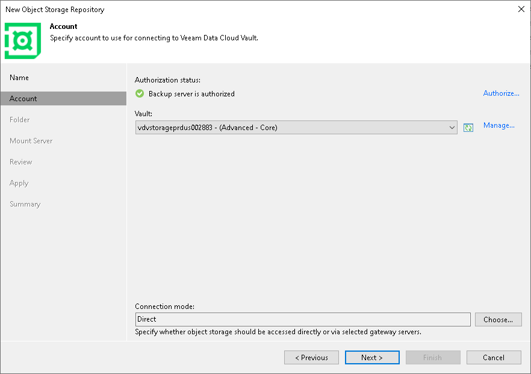
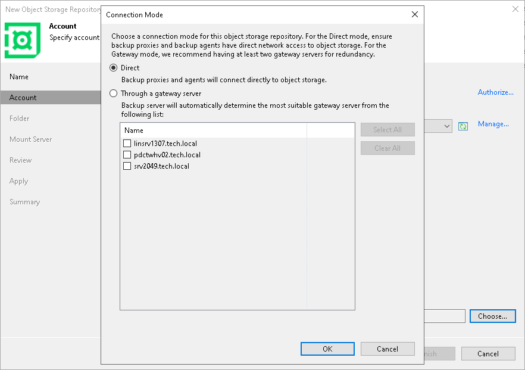

# Step 3. Specify Veeam Account

In this article

At the Account step of the wizard, specify credentials for the Veeam account and the storage vault.

Specifying User Credentials

To specify the authorization settings:

1. To authorize using your Veaam credentials, click the Authorize link.
2. In the Veeam authorization window enter your credentials for the Veeam account. After that, your backup server will be registered in the My Account portal.

|  |
| --- |
| Note |
| Ensure that the email address you use matches the email address of the License Administrator. Consider that this email address is case-sensitive. If you plan to delegate access to another user, make sure that he also has the License Administrator role. |

1. In the Vault drop-down list, specify the storage vault that you want to use. To manage vaults, click the Manage link. For more information, see the [Managing Veeam Data Cloud Vault Subscriptions](https://helpcenter.veeam.com/docs/vdc/userguide/vault_manage_subscriptions.html) section in the Veeam Data Cloud User Guide.

|  |
| --- |
| Note |
| If you have only one storage vault that has not been associated with any backup server before, this vault will appear in the drop-down list automatically. |

If you do not have any storage vaults associated with your backup server, the Vault drop-down list will be empty. For detailed instructions on how to obtain a vault and assign it to your backup server, see the [Obtaining Veeam Data Cloud Vault](https://helpcenter.veeam.com/docs/vdc/userguide/vault_obtain_product.html) section in the Veeam Data Cloud User Guide. After you add a storage vault and assign it to the backup repository, click the refresh icon (). The vault will show up in the drop-down list.

|  |
| --- |
| Important |
| Keep in mind that it might take several minutes to add a certificate (a public key) on the Microsoft Azure Entra ID side. |

Specifying Connection Mode

To specify connection settings, next to the Connection mode field, click Choose and specify how Veeam Backup & Replication will transfer data to the object storage repository:

* Direct — select this option if you want to instantly move data of processed VMs or file shares to object storage repositories. Before you select this option, check the following [Considerations and Limitations](object_storage_repository_cal.md#directmode).

* Through gateway server — select this option if you want Veeam Backup & Replication to use gateway servers to transfer data from processed machines or file shares to object storage repositories. From the Name list, select gateway servers that you want to use for data transfer operations.

By default, the role of a gateway server is assigned to the Veeam Backup & Replication server. You can choose any Microsoft Windows or Linux server that is added to your backup infrastructure and has internet connection. Note that you must add the server to the backup infrastructure beforehand. Before you add the server, check the following [Considerations and Limitations](object_storage_repository_cal.md). For more information on how to add a server, see [Virtualization Servers and Hosts](setup_add_server.md).

Page updated 11/20/2025

Page content applies to build 13.0.1.1071
