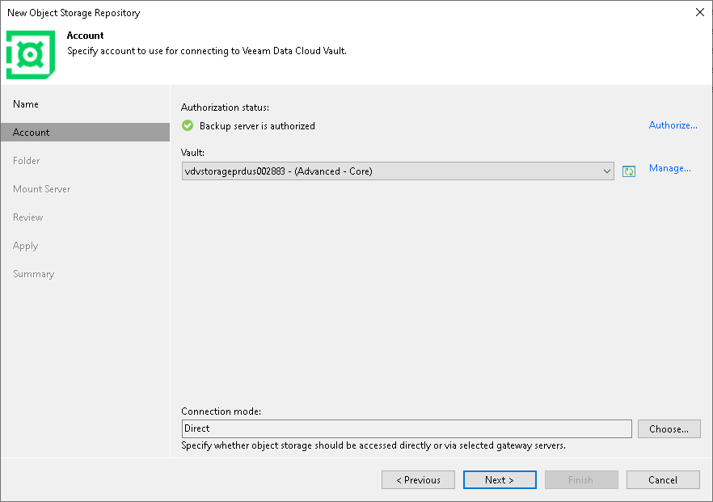
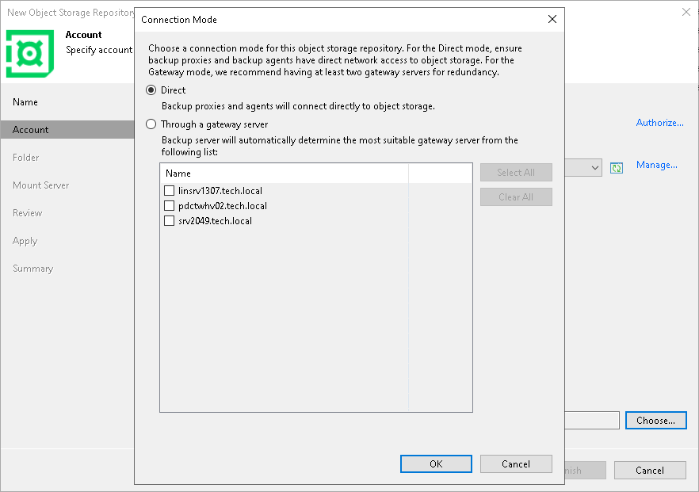

# Step 3. Specify Veeam Account

At the Account step of the wizard, do the following:

1. [Specify storage vault settings](#settings).
2. [Specify connection mode settings](#connectionmode).

Specifying Storage Vault Settings

To specify the storage vault settings:

1. To authorize using your Veeam credentials, click the Authorize link.
2. In the Veeam authorization window enter your credentials for the Veeam account. After that, your backup server will be registered in Veeam Data Cloud.

|  |
| --- |
| Note |
| Consider the following:   * Ensure that the email address you use matches the email address of the License Administrator. Consider that this email address is case-sensitive. If you plan to delegate access to another user, make sure that this user also has the License Administrator role. * In Veeam Backup & Replication earlier than build 13.0.1.2067, the account you use must have access to the My Account portal and Veeam Data Cloud. Veeam will register the backup server in My Account and in Veeam Data Cloud. * In Veeam Backup & Replication build 13.0.1.2067 and later, the account you use does not need access to the My Account portal. Starting from this product version, Veeam Backup & Replication and Veeam Data Cloud Vault are connected directly, without using My Account. Veeam will register the backup server in Veeam Data Cloud. |

1. From the Vault drop-down list, select the storage vault that you want to use. To manage storage vaults, click the Manage link.

|  |
| --- |
| Note |
| Consider the following:   * If you have only one storage vault that has not been associated with any backup server before, this vault will appear in the drop-down list automatically. * If you do not have any storage vaults associated with your backup server, the Vault drop-down list will be empty. For detailed instructions on how to assign a storage vault to your backup server, see the [Assigning Storage Vaults to Workloads](https://helpcenter.veeam.com/docs/vdc/userguide/vault_storage_vaults_edit.html#assigning-storage-vaults-to-workloads) section in the Veeam Data Cloud User Guide. After you add a storage vault and assign it to the backup server, click the refresh icon (). The vault will show up in the drop-down list. * Keep in mind that it might take several minutes to add a certificate (a public key) on the Microsoft Azure Entra ID side. |

Specifying Connection Mode

By default, Veeam Backup & Replication uses the Direct mode to transfer data to an object storage repository. To specify different connection settings, do the following:

1. Next to the Connection mode field, click Choose.
2. In the Connection Mode window, select one of the following:

* Direct — select this option if you want to instantly move data of processed VMs or file shares to object storage repositories. Before you select this option, check the following [Considerations and Limitations](object_storage_repository_cal.md#directmode).
* Through a gateway server — select this option if you want Veeam Backup & Replication to use gateway servers to transfer data from processed machines or file shares to object storage repositories. From the Name list, select gateway servers that you want to use for data transfer operations.

By default, the role of a gateway server is assigned to the Veeam Backup & Replication server. You can choose any Microsoft Windows or Linux server that is added to your backup infrastructure and has internet connection. Note that you must add the server to the backup infrastructure beforehand. Before you add the server, check the following [Considerations and Limitations](object_storage_repository_cal.md). For more information on how to add a server, see [Virtualization Servers and Hosts](setup_add_server.md).

