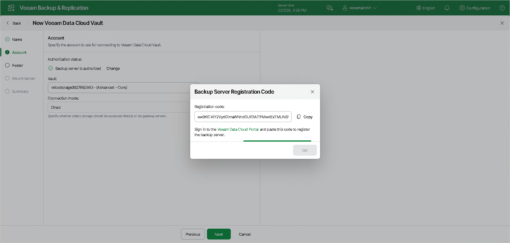
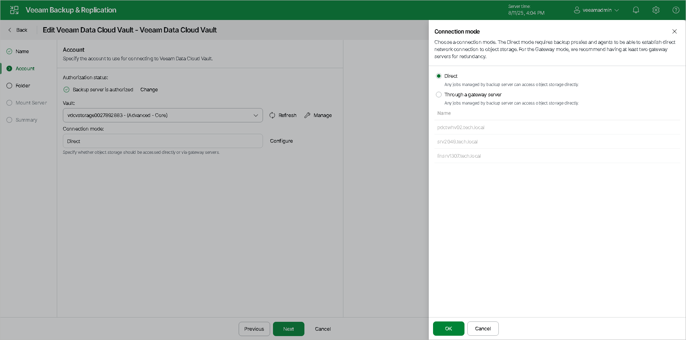

# Step 3. Specify Veeam Account

At the Account step of the wizard, register the backup server with Veeam Data Cloud using your Veeam credentials, specify the storage vault and its connection settings.

Registering Backup Server

To register the backup server using your Veeam credentials, do the following:

1. Click the Change link. After that, the Backup Server Registration Code window will appear.
2. To the right of the Registration Code field, click Copy.
3. Click the Veeam Data Cloud Portal link. You will be moved to Veeam Data Cloud. Enter your Veeam credentials.

|  |
| --- |
| Note |
| Ensure that the email address you use matches the email address of the License Administrator. Consider that this email address is case-sensitive. If you plan to delegate access to another user, make sure that he also has the License Administrator role. |

1. In the Register New Product window, under the Registration Token filed, paste the registration code you have copied.
2. Click Register. The backup server will be registered with Veeam Data Cloud.
3. Select the storage vault that you want to use. For more information, see [Specifying Storage Vault Settings](#vault).

1. Specify connection settings. For more information, see [Specifying Connection Mode](#connectionmode).

Specifying Storage Vault Settings

To specify the Vault settings, do the following:

From the Vault drop-down list, select the storage vault that you want to use. To manage vaults, click the Manage link.

|  |
| --- |
| Note |
| Consider the following:   * If you have only one storage vault that has not been associated with any backup server before, this vault will appear in the drop-down list automatically. * If you do not have any storage vaults associated with your backup server, the Vault drop-down list will be empty. For detailed instructions on how to assign a storage vault to your backup server, see the [Assigning Storage Vaults to Workloads](https://helpcenter.veeam.com/docs/vdc/userguide/vault_storage_vaults_edit.html#assigning-storage-vaults-to-workloads) section in the Veeam Data Cloud User Guide. After you add a storage vault and assign it to the backup server, click the refresh icon (). The vault will show up in the drop-down list. * Keep in mind that it might take several minutes to add a certificate (a public key) on the Microsoft Azure Entra ID side. |

Specifying Connection Mode

To specify connection settings, next to the Connection mode field, click Choose and specify how Veeam Backup & Replication will transfer data to the object storage repository:

* Direct — select this option if you want to instantly move data of processed VMs or file shares to object storage repositories. Before you select this option, check the following [Considerations and Limitations](object_storage_repository_cal.md#directmode).

* Through gateway server — select this option if you want Veeam Backup & Replication to use gateway servers to transfer data from processed machines or file shares to object storage repositories. From the Name list, select gateway servers that you want to use for data transfer operations.

By default, the role of a gateway server is assigned to the Veeam Backup & Replication server. You can choose any Microsoft Windows or Linux server that is added to your backup infrastructure and has internet connection. Note that you must add the server to the backup infrastructure beforehand. Before you add the server, check the following [Considerations and Limitations](object_storage_repository_cal.md). For more information on how to add a server, see [Virtualization Servers and Hosts](setup_add_server.md).

