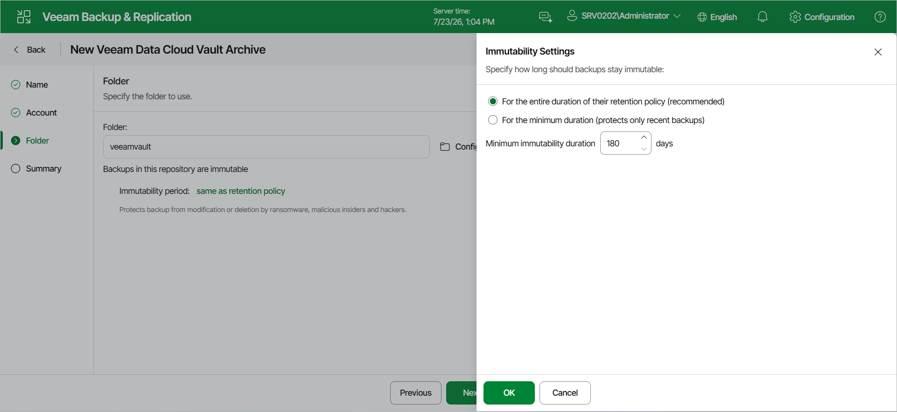

# Step 4. Specify Veeam Data Cloud Vault Archive Settings

At the Folder step of the wizard, specify the folder that will be used to store data, the storage consumption and the immutability period.

1. To the right of the Folder field, click Configure.
2. In the Select folder window, either select an existing folder or click Add New Folder.
3. To refresh the list of folders, click Refresh
4. To prohibit deletion of blocks of data from object storage, select the Make recent backups immutable (recommended) check box. In the Immutability Settings window, specify how the immutability period is counted and set the immutability period in days:

* Select For the entire duration of their retention policy if you want the immutability period depend on the retention policy of a backup job.

|  |
| --- |
| Important |
| Consider the following:   * If the GFS retention period is shorter than the minimum immutability period configured for the repository, the minimum immutability period applies. * If the GFS retention period is longer, the backup is kept for the entire GFS period.   For more information, see [Immutability for Archive Tier](immutability_archive_tier.md). |

* Select the For the minimum immutability period only option if you want to specify the immutability period explicitly. The backup job retention will be skipped.

* Next to the Minimum immutability duration option, provide the necessary value.

|  |
| --- |
| Note |
| Consider the following:   * By default, immutability is enabled for Veeam Data Cloud Vault. You cannot disable this option and cannot remove data during this period.  * The default immutability period is 180 days. You can set the immutability period to different values. The maximum immutability period is 999 days. |

Page updated 2026-07-29

