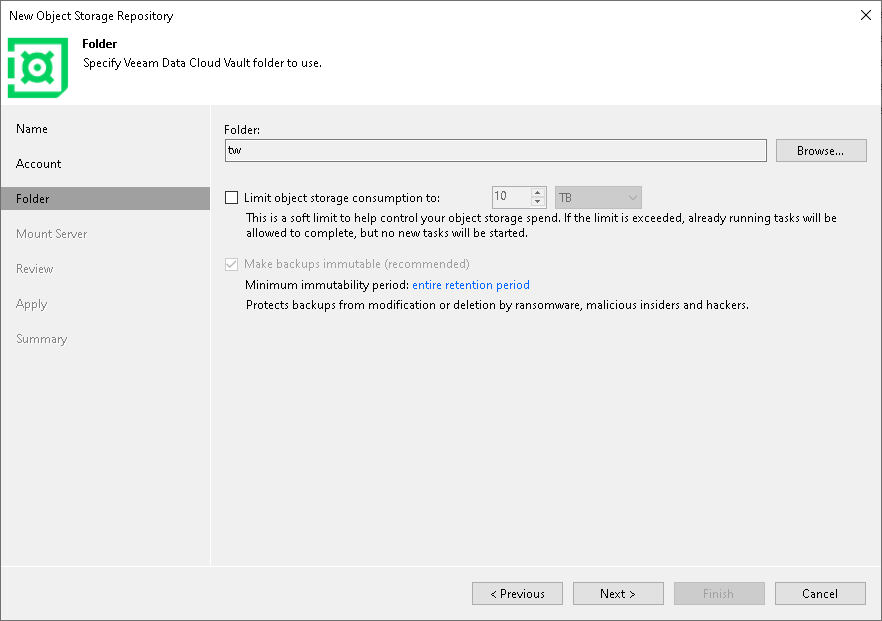
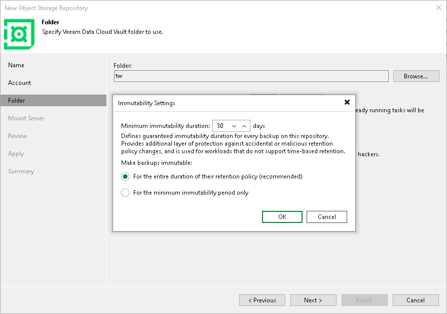

# Step 4. Specify Object Storage Settings

In this article

At the Container step of the wizard, specify the folder that will be used to store data, the storage consumption and the immutability period.

1. To the right of the Folder field, click Browse and either select an existing folder or click New Folder.
2. Select the Limit object storage consumption to check box to define a soft limit for your object storage consumption. If this limit is exceeded during a job run, Veeam Backup & Replication will complete the job. However, a new job will not be able to start unless you remove the extra data that exceeds the limit or change the soft limit settings. Provide the value in TB or PB.

Specifying Immutability Settings

To prohibit deletion of blocks of data from object storage, select the Make recent backups immutable (recommended) check box. In the Immutability Settings window, specify how the immutability period is counted and set the immutability period in days:

* Select For the entire duration of their retention policy if you want the immutability period depend on the retention policy of a backup job.

|  |
| --- |
| Important |
| Consider the following:   * If the job retention exceeds the immutability period, the actual retention is counted as job retention policy + Block Generation period. * If the immutability period exceeds the job retention period, the actual retention is counted as immutability period + Block Generation period.   For more information, see [How Immutability Works](hiw_immutability_os.md), |

* Select For the minimum immutability period only if you want to specify the immutability period explicitly. The backup job retention will be skipped.
* Next to the Minimum immutability duration option, provide the necessary value.

|  |
| --- |
| Note |
| Consider the following:   * By default, immutability is enabled for Veeam Data Cloud Vault. You cannot disable this option and cannot remove data during this period. * The default immutability period is for 30 days. You can set the immutability period to different values in the Veeam Backup & Replication UI. The minimum immutability period is 1 day, and the maximum is 999 days. If you want to set immutability to a longer period, use the [Set-VBRDataCloudVaultRepository](https://helpcenter.veeam.com/docs/vbr/powershell/set-vbrdatacloudvaultrepository.html?ver=13) cmdlet. |

Page updated 11/21/2025

Page content applies to build 13.0.1.1071
