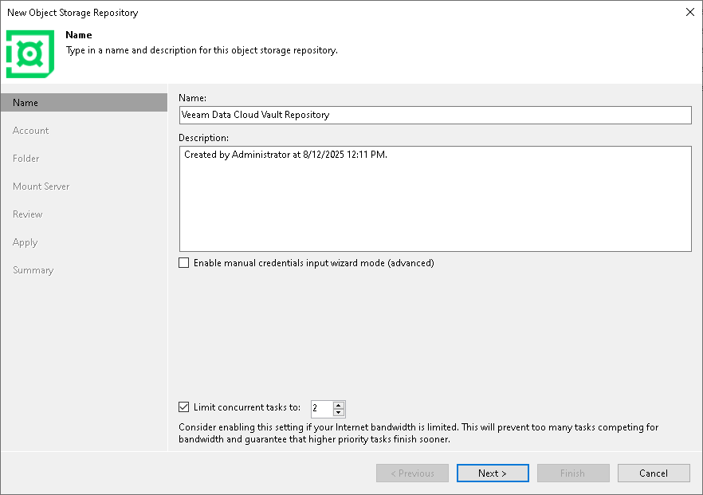

# Step 2. Specify Object Storage Name

At the Name step of the wizard, use the Name and Description fields to enter a name for a new object storage repository and to provide a description for future reference.

To enter user credentials using the service key at the [Account](veeam_data_cloud_account.md) step of the wizard, select the Enable manual credential input wizard mode (advanced) check box.

If you want to limit the maximum number of tasks that can be processed at once, select the Limit concurrent tasks to N check box.

