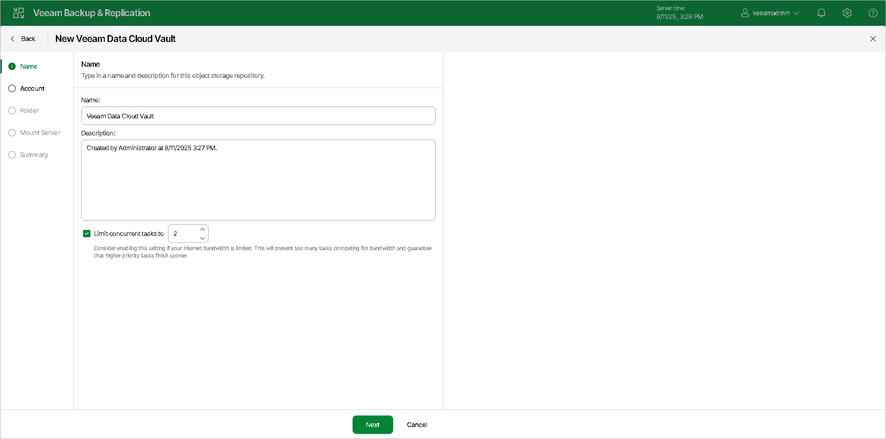

# Step 2. Specify Veeam Data Cloud Vault Name

At the Name step of the wizard, specify the following:

1. In the Name field, specify a name for the object storage repository.
2. In the Description field, provide a description for future reference.

If you want to limit the maximum number of tasks that can be processed at once, select the Limit concurrent tasks to N check box.

