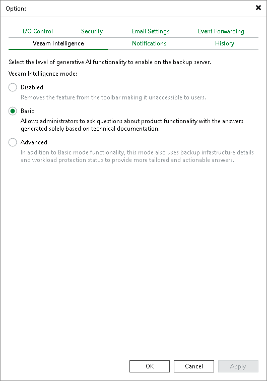

# Configuring Veeam Intelligence Settings Using Console

In this article

To configure Veeam Intelligence settings, do the following in the Veeam Backup & Replication console:

1. From the main menu, select Options.
2. Click the Veeam Intelligence tab.
3. Under Veeam Intelligence mode, choose one of the following options:

* To disable Veeam Intelligence and hide it in the user interface, select the Disabled option.
* To enable the Veeam Intelligence basic mode, select the Basic option.
* To enable the Veeam Intelligence advanced mode, select the Advanced option. For more information, see [Advanced Mode](veeam_ai_online_assistant.md#advanced_mode).

Page updated 1/6/2026

Page content applies to build 13.0.1.1071
