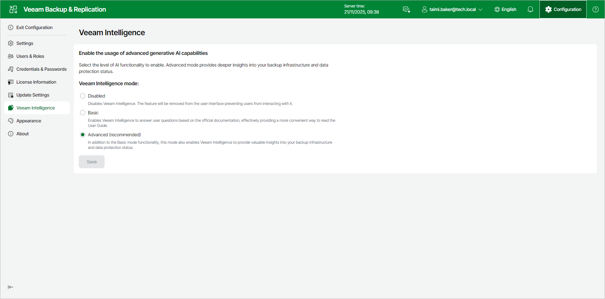

# Configuring Veeam Intelligence Settings Using Web UI

To configure Veeam Intelligence settings, do the following in the Veeam Backup & Replication web UI:

1. Click Configuration in the top bar.
2. In the Configuration menu, click Veeam Intelligence.
3. In the Veeam Intelligence Mode section, choose one of the following options:

* To disable Veeam Intelligence and hide it in the user interface, select the Disabled option.
* To enable the Veeam Intelligence basic mode, select the Basic option.
* To enable the Veeam Intelligence advanced mode, select the Advanced option. For more information, see [Advanced Mode](veeam_ai_online_assistant_web.md#advanced_mode).

If you select the Advanced option, you can additionally select the Enable full administrative access check box to let Veeam Intelligence perform privileged operations.

|  |
| --- |
| Important |
| Privileged operations may affect protected workloads, that is modify or delete data, change system settings or run administrative scripts. Enable full administrative access only if you understand and accept the risks. |

1. Click Save.

Page updated 2026-07-08

