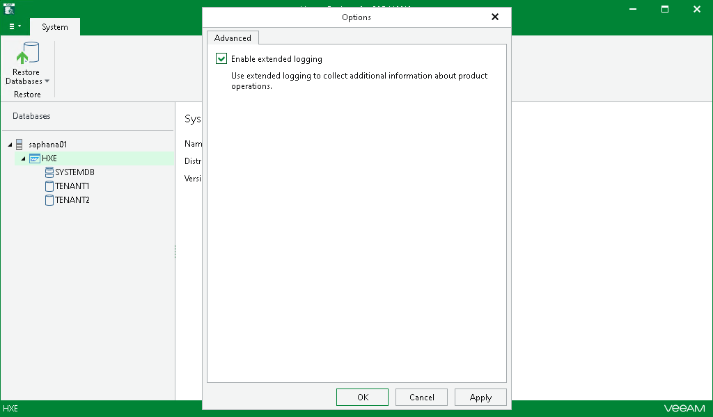

# Enabling Extended Logging

Veeam Explorer for SAP HANA allows you to enable an extended logging mode to collect more detailed logs on specific operations. After you enable extended logging, you can go back to the application and perform the actions for which you want to collect additional information. Then you can collect the logs. For more information on log collection, see [Getting Support](vehana_support.md).

To enable extended logging, do the following:

1. In the Veeam Explorer for SAP HANA main menu, click General Options.
2. On the Advanced tab, select the Enable extended logging check box and click OK.

