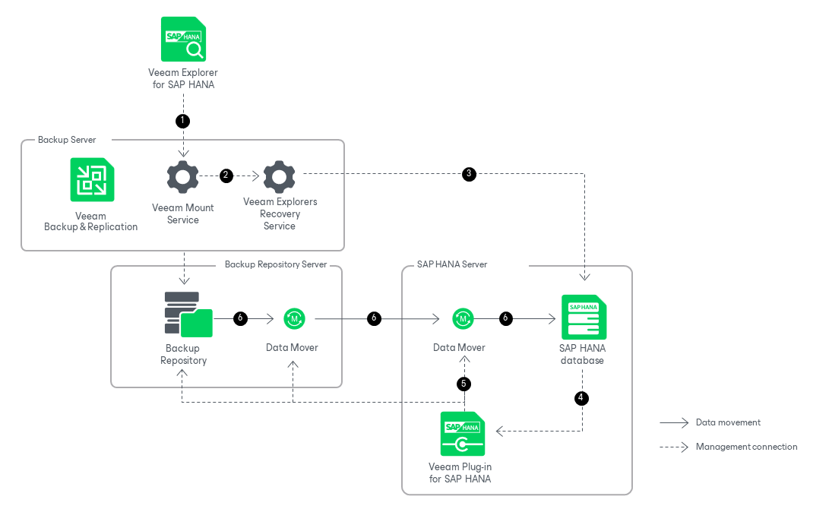

# How Restore Works

In this article

Restoring SAP HANA databases with Veeam Explorer for SAP HANA works in the following manner:

1. To start the restore process, Veeam Explorer for SAP HANA sends a restore command to the Veeam Mount Service. The service runs on the backup server.
2. The Veeam Mount Service delegates this request to the Veeam Explorers Recovery Service running on the same server.
3. To start the restore process on the target server, the Veeam Explorers Recovery Service creates a restore job. The service sends a restore command through SAP Web Services to the SAP HANA system on the target server. The restore command can be sent using HTTP or HTTPS.
4. On the target server, the SAP HANA system requests data from Veeam Plug-In for SAP HANA.
5. Veeam Plug-In for SAP HANA retrieves data from the backups stored in the backup repository and starts Veeam Data Mover services on the backup repository and the target SAP HANA server.
6. Veeam Data Movers transport the SAP HANA data from the backup repository to the target server. The SAP HANA system on the target server applies the changes to the relevant databases.

Page updated 9/26/2025

Page content applies to build 13.0.1.1071
