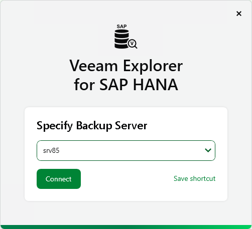
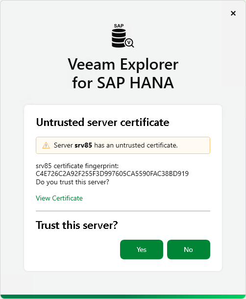
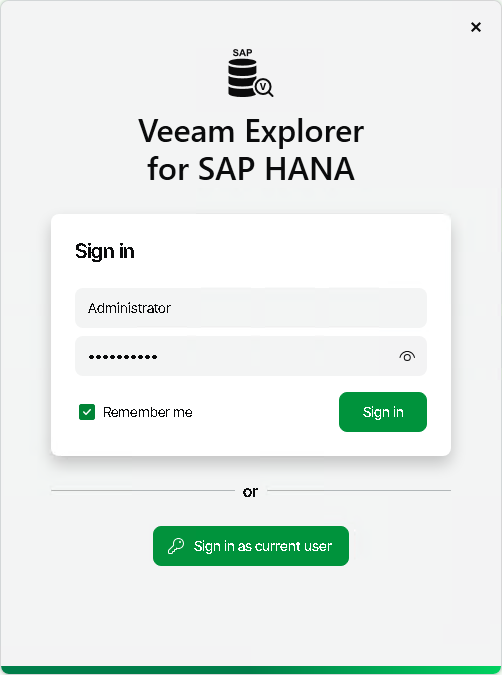

# Launching Application

In this article

To open Veeam Explorer for SAP HANA, you can use either of the following methods:

* Use the Restore from SAP HANA backup option in Veeam Backup & Replication to load backups created either with an application backup policy in Veeam Backup & Replication or a backup job managed by a standalone Veeam Plug-In for SAP HANA. For more information, see [Required Job Settings](vehana_job_settings.md).

* Use the Start menu method to, for example, manage ongoing restore sessions or check the installed product version. Note that this method does not load any backups and does not allow you to start new restore sessions.

To launch the application, go to Start, click Veeam Explorer for SAP HANA and perform the following steps:

1. At the Specify Backup Server step, type the DNS name or IP address of the backup server you want to use or select it from the list of recent connections. To save the connection shortcut to the desktop, click Save shortcut in the bottom-right corner.

Click Connect.

1. When you are connecting to the backup server for the first time, Veeam Explorer for SAP HANA will ask you to validate the backup server certificate fingerprint. Click View Certificate to see more details about the imported certificate.

Click Yes to install the certificate on the machine where you are launching Veeam Explorer for SAP HANA.

1. At the Sign in step, enter the credentials of the user account that you want to use to connect to the backup server. For more information on the required permissions for the user, see [Permissions](vehana_permissions.md).

Select the Remember me check box if you do not want to enter the credentials again the next time you sign in to this backup server.

Click Sign in.

Alternatively, select Sign in as current user to use the credentials of the Windows user account currently signed in on the machine where you are launching Veeam Explorer for SAP HANA.

In This Section

[Getting to Know User Interface](vehana_know_ui.md)

Page updated 11/18/2025

Page content applies to build 13.0.1.1071
