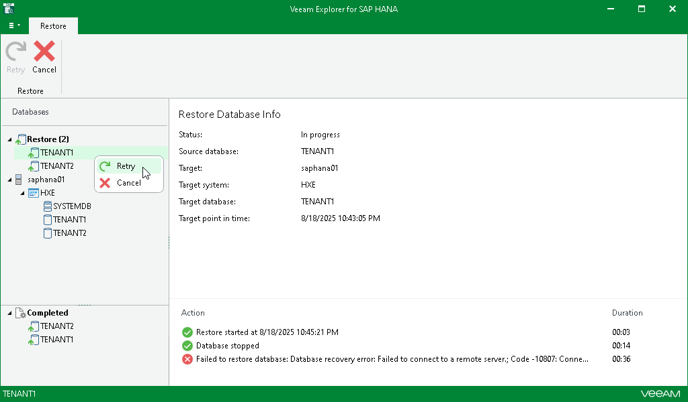
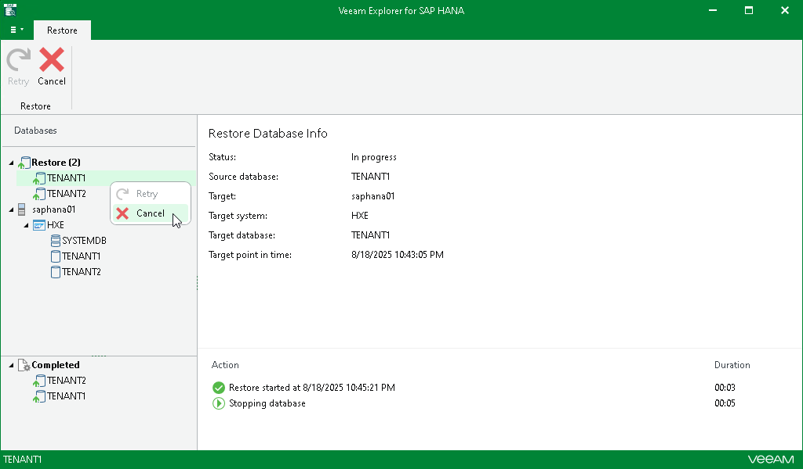

# Managing Restore Session

In this article

After you finish the steps of the Restore wizard, Veeam Explorer for SAP HANA starts a restore session.

Under the Restore node in the upper part of the navigation pane, you can find the databases with an ongoing restore process. Click a database to get a more detailed overview of the progress of its restore process in the preview pane.

If a database is successfully restored or its restore process is canceled, it moves to the Completed node in the bottom section of the navigation pane.

At this step, you can also manually retry the restore session if something interrupts it, or cancel the session.

Retrying Restore

If anything disrupts the restore process (the target server crashes or the network is down), you can launch the retry manually after the server or network is up. You cannot manually launch retry of an ongoing restore session.

To retry one or all ongoing restore sessions, do the following:

1. In the navigation pane, click the Restore node to select all ongoing restore sessions, or select the relevant database.
2. On the Restore tab, select Retry.

Alternatively, you can right-click the Restore node or the relevant database and select Retry.

Canceling Restore

To cancel one or all ongoing restore sessions, do the following:

1. In the navigation pane, click the Restore node to select all ongoing restore sessions, or select the relevant database.
2. On the Restore tab, select Cancel.

Alternatively, you can right-click the Restore node or the relevant database and select Cancel.

|  |
| --- |
| Note |
| Consider the following:   * Canceling a restore session of a tenant database will leave the database on the target server in an inconsistent state. A new recovery process will be necessary to resolve the situation. * Canceling the restore session of the system database is not supported. |

Page updated 8/25/2025

Page content applies to build 13.0.1.1071
