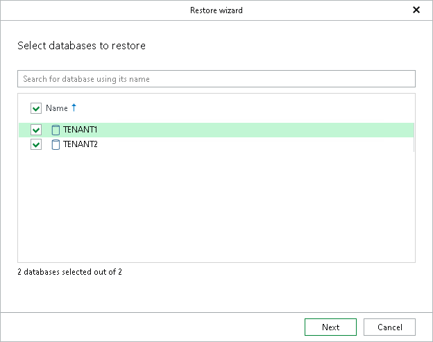

# Step 2. Select Databases

At this step of the wizard, select the databases that you want to recover.

To quickly find the necessary databases, use the search field or sort the databases by name.

|  |
| --- |
| Note |
| The system database cannot be added to restore operations containing multiple databases. This is because you cannot simultaneously restore the system database of an SAP HANA system and its tenant databases — the SAP HANA system must be offline before you can restore the system database, while tenant databases require the system to be online during restore. |

