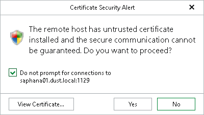
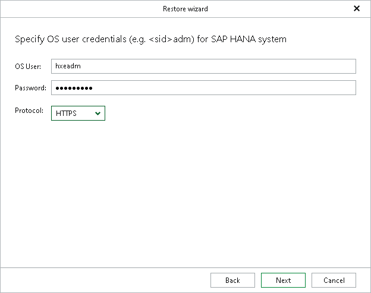

# Step 3. Specify Server Credentials

In this article

At this step of the wizard, specify the connection parameters for the target SAP HANA server.

1. In the OS User field, specify the operating system user (<sid>adm).
2. In the Password field, specify the password for the operating system user.
3. In the Protocol drop-down list, select the protocol that Veeam Explorer for SAP HANA will use to connect to SAP Web Services, which are then used to control the target SAP HANA system.

* Select HTTPS to establish a secure connection to the target server. Selecting this option will import 2 certificates issued by the target server to the backup server (2 certificates per host in multiple-host systems). The first certificate is used to securely connect to the SAP Control web service and the second to the SAP Start web service. Before proceeding with the Restore wizard, Veeam Explorer for SAP HANA will prompt you to review each certificate in a separate Certificate Security Alert dialog box.

* Select the Do not prompt for connections to <host\_name:port> check box if you want to use the certificate in future restore operations to the specified server. The certificate thumbprint will be saved to a Config.xml file, located in the UserProfile%\AppData\Local\Veeam\Backup\SapHanaExplorer directory on the machine where Veeam Explorer for SAP HANA is running.

* Click View Certificate... to see more details about the imported certificate.

* Select HTTP only if your backup infrastructure requires minimal security precautions and you want to quickly restore SAP HANA data. This option does not import any certificates to the backup server.

For more information about the ports used to connect to SAP Web Services, see [Ports](vehana_used_ports.md).

Page updated 8/18/2025

Page content applies to build 13.0.1.1071
