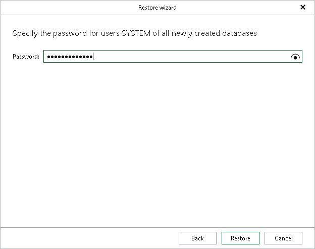

# Step 6. Specify SYSTEM User Password

This step of the wizard is only available if any of the databases selected at the [Select Databases](vehana_restore_multiple_pit_select_databases.md) step do not exist on the target server. In this case, the SAP HANA system creates new tenant databases on the target server and a new SYSTEM user for the new databases.

At this step, specify a password for this new SYSTEM user and click Restore.

The password policy follows the default SAP HANA configuration — the password must contain at least 8 characters, one uppercase, one lowercase letter, and one number.

|  |
| --- |
| Note |
| This password applies to all databases created during the restore process. |

