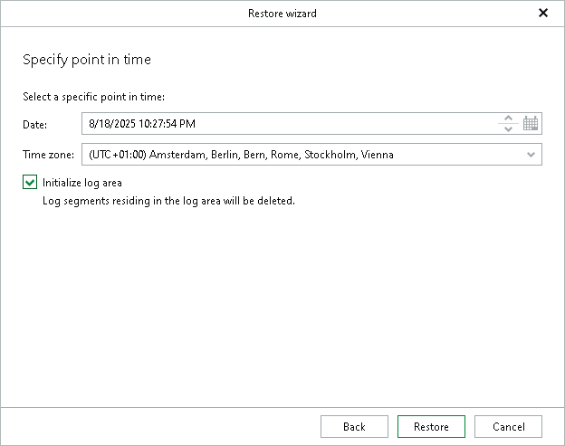

# Step 5. Specify Point in Time

At this step of the wizard, specify a point in time to which you want to restore the selected SAP HANA databases.

1. In the Date field, specify the date and time of the state to which you want to restore your database.
2. From the Time zone drop-down list, select the time zone for the time specified in the Date field. By default, Veeam Explorer for SAP HANA displays the time zone of the backup server.
3. Select the Initialize log area check box to remove all log segments in the log area or, in other words, to clear the part of the system memory that temporarily stores transaction logs before they are moved to the log backups. This allows you to restore the database to the latest available log backup before the selected point in time.

Note that initializing the log area may cause loss of in-memory data, so perform this action only if the log area is unavailable. If you do not initialize the log area when the log area is unavailable, the restore operation will fail. To resolve this issue, repeat the restore operation with the Initialize log area check box selected.

1. Click Restore.

Each database will be restored to the most recent available state to the date and time selected in the Date field. Note that if any of the databases that you want to restore were first backed up after the specified point in time, their restore process will fail.

