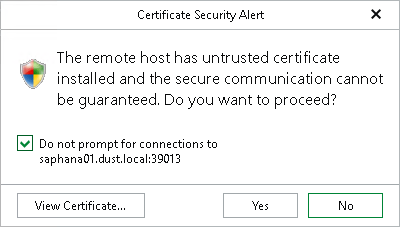
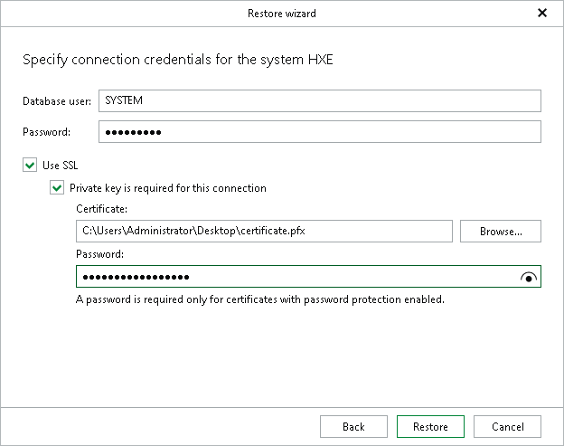

# Step 3. Specify System Credentials

In this article

This step of the wizard is only available if you are restoring a tenant SAP HANA database.

At this step, specify the connection parameters for the target SAP HANA system.

1. In the Database user field specify an SAP HANA database user. For more information about the necessary permissions for this user, see [Permissions](vehana_permissions.md).
2. In the Password field, specify the password for the database user.
3. Select the Use SSL check box to establish a secure SSL connection to the target SAP HANA system.

* Selecting this option will import a certificate issued by the target server to the backup server. Before proceeding with the Restore wizard, Veeam Explorer for SAP HANA will prompt you to review the certificate in the Certificate Security Alert dialog box.

* Select the Do not prompt for connections to <host\_name:port> check box if you want to use the certificate in future restore operations to the specified server. The certificate thumbprint will be saved to a Config.xml file, located in the UserProfile%\AppData\Local\Veeam\Backup\SapHanaExplorer directory on the machine where Veeam Explorer for SAP HANA is running.
* Click View Certificate... to see more details about the imported certificate.

* Select the Private key is required for this connection check box to also use a private key generated on the target SAP HANA system to validate the user of the backup server. Once you import the private key on the backup server, perform the following actions:

* In the Certificate field, specify a file that contains a private key.

To locate a file, click Browse and select a key.

* In the Password field, enter the passphrase used to decrypt the private key.

For more information about how to generate a private client key on the target SAP HANA system, see the [SAP Help Portal](https://help.sap.com/docs/SAP_HANA_CLIENT/f1b440ded6144a54ada97ff95dac7adf/1451ee6d152a4d05983e4392dc7cfb5c.html).

Note that before you restore a tenant database using SSL, you must have SAP Common Crypto Library installed on the backup server. For more information about how to install SAP Common Crypto Library on Windows machines, see the [SAP Help Portal](https://help.sap.com/docs/SAP_DATA_SERVICES/e54136ab6a4a43e6a370265bf0a2d744/c049e28431ee4e8280cd6f5d1a8937d8.html?locale=en-US).

1. Click Restore.

Page updated 11/13/2025

Page content applies to build 13.0.1.1071
