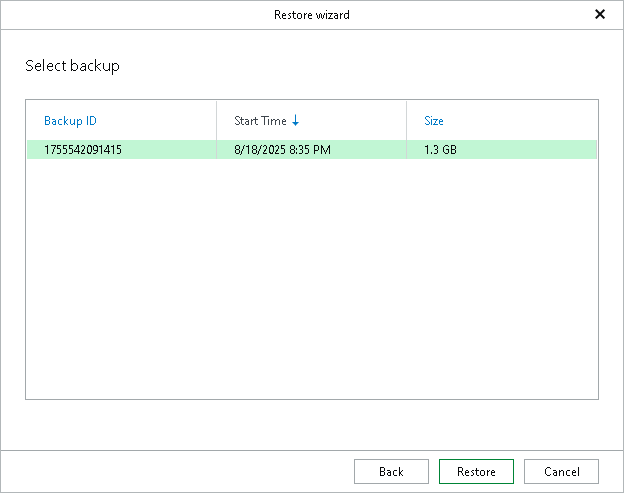

# Step 6. Select Backup

This step of the wizard is only available if you have selected Recover using the backup catalog at the [Specify Recovery Catalog Options](vehana_restore_single_pit_specify_recovery_catalog.md) step.

At this step, select one of the available full data backups and click Restore.

You can sort the available data backups by their backup IDs, the time they were created and by their size. Note that the displayed start time of the backups uses the time zone of the backup server.

