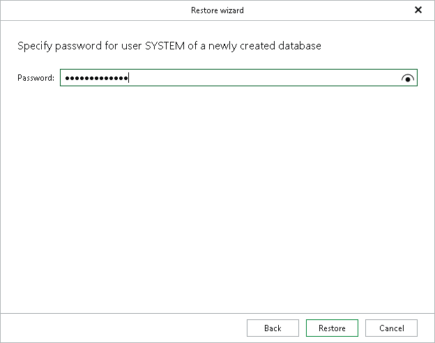

# Step 7. Specify SYSTEM User Password

This step of the wizard is only available if the restore process creates a new tenant database on the target server.

At this step, specify a password for the new SYSTEM user of the new database and click Restore.

The password policy follows the default SAP HANA configuration — the password must contain at least 8 characters, one uppercase, one lowercase letter, and one number.

