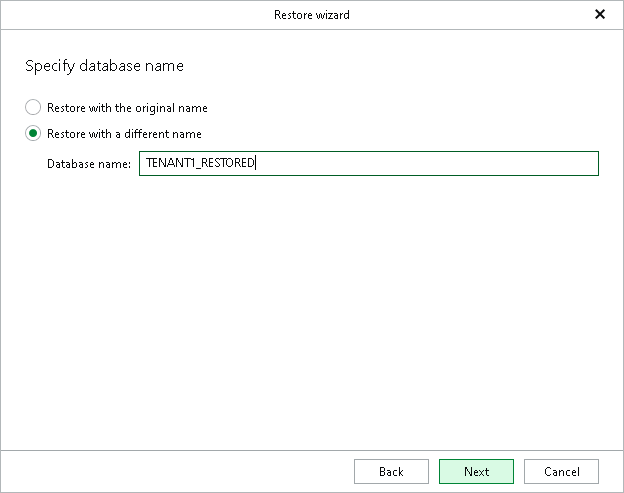

# Step 4. Specify Database Name

In this article

At this step of the wizard, specify the name of restored database on the target SAP HANA system.

* Select Restore with the original name to keep the original name of the database on the target SAP HANA system.
* Select Restore with a different name to change the name of the restored database on the target SAP HANA system.

In Database name field, type the name of the restored database. Make sure that the name does not contain keywords that belong to the RESERVED\_KEYWORDS system view. For more information, see [Considerations and Limitations](vehana_considerations.md).

Page updated 8/18/2025

Page content applies to build 13.0.1.1071
