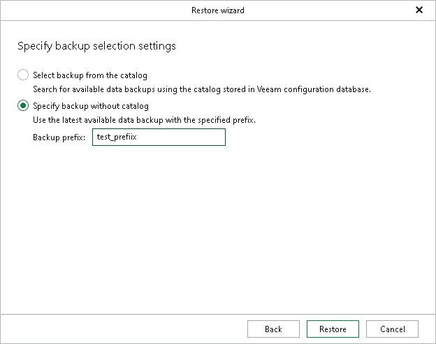

# Step 6. Specify Recovery Catalog Options

In this article

This step of the wizard is only available if you have selected Recover to a specific data backup at the [Specify Recovery Type](vehana_restore_single_tas_specify_recovery_type.md) step.

At this step of the wizard, you can choose whether to restore SAP HANA data by selecting a full backup from the backup catalog stored in the Veeam Backup & Replication configuration database, or by using the necessary backup prefix.

* The Select backup from the catalog option allows you to restore your database from any of the available full backups stored in the Veeam Backup & Replication configuration database. The backup catalog is available for both backups made with application backup policies managed by Veeam Backup & Replication and backup jobs managed by a standalone Veeam Plug-In for SAP HANA.
* The Specify backup without catalog option allows you to restore your database from a backup with the specified backup prefix. Use this option for backups created with the standalone Veeam Plug-In for SAP HANA. For more information, see [Database Protection](sap_hana_backup.md).

To specify the backup prefix of the backup you want to use, use the Backup prefix field. If multiple backups have the same prefix, Veeam Explorer for SAP HANA uses the most recent backup associated with that backup prefix.

Page updated 8/20/2024

Page content applies to build 13.0.1.1071
