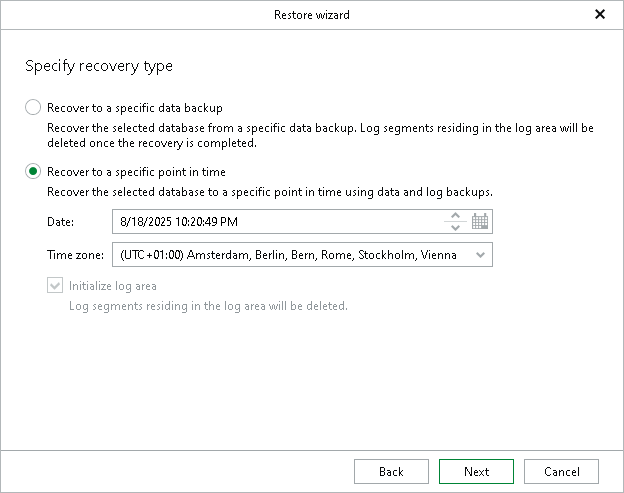

# Step 5. Specify Recovery Type

In this article

At this step of the wizard, specify whether to restore your database as of a specific data backup, or a point in time within a data backup.

* Select Recover to a specific data backup to restore the database as of a specific data backup. You can select the necessary backup at the next step of the wizard.

Note that this action clears all transaction logs stored in the system memory that were not yet saved to the log backups at the time of backup.

* Select Recover to a specific point in time to restore the database as of a specific point in time.

1. In the Date field, specify the date and time of the state to which you want to restore your database.
2. From the Time zone drop-down list, select the time zone for the time specified in the Date field. By default, Veeam Explorer for SAP HANA displays the time zone of the backup server.

The Initialize log area check box is automatically selected and grayed out when you restore your data to another server, to ensure stable operation of the tenant databases on the target SAP HANA system.

This action removes all log segments in the log area or, in other words, clears the part of the system memory that temporarily stores transaction logs before they are moved to the log backups. The database is restored to the latest available log backup before the selected point in time.

If you select the Recover to a specific data backup option, proceed to the next step of the wizard. If you select the Recover to a specific point in time option, click Restore.

Page updated 8/18/2025

Page content applies to build 13.0.1.1071
