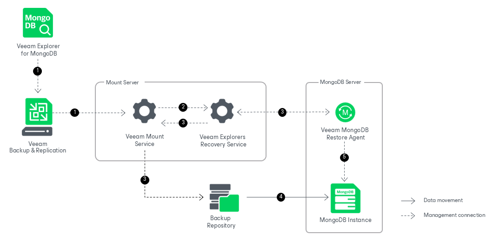

# How Publishing Works

In this article

Publishing the entire MongoDB instance with Veeam Explorer for MongoDB works in the following manner:

1. To start the publishing process, Veeam Explorer for MongoDB sends a publishing command to the Veeam Mount Service. The service runs on the mount server associated with the backup repository.
2. The Veeam Mount Service delegates this request to the Veeam Explorers Recovery Service running on the same server.
3. The Veeam Explorers Recovery Service deploys the Veeam MongoDB Restore Agent on the target MongoDB server. The Veeam MongoDB Restore Agent validates the permissions of the selected user and checks if there is enough free space on the target server.

The Veeam Explorers Recovery Service sends a request to the Veeam Mount Service to connect to the backup repository and initiate the mounting operation.

1. The Veeam Mount Service uses FUSE to mount the necessary file system from the backup repository to the /run/media directory of the target MongoDB server.
2. The Veeam MongoDB Restore Agent opens the instance from the mounted file system, so that you can perform the required operations with MongoDB tools. If you are publishing the instance to a point-in-time state, the restore agent will replay the oplog entries from the backup.

All changes in instance files that occur after publishing are saved in the publishing write cache, which is stored in the /var/lib/veeam/IRCache folder on the mount server.

Once the publishing operation is completed, you can restore the collections managed by the published instance. For more information, see [Restoring From Published Instances](vemdb_rs_published_restore.md).

Page updated 11/4/2025

Page content applies to build 13.0.1.1071
