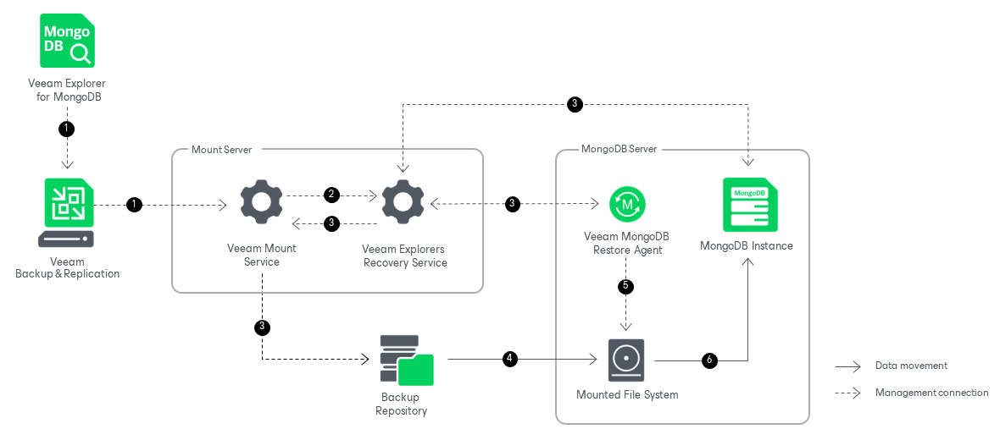
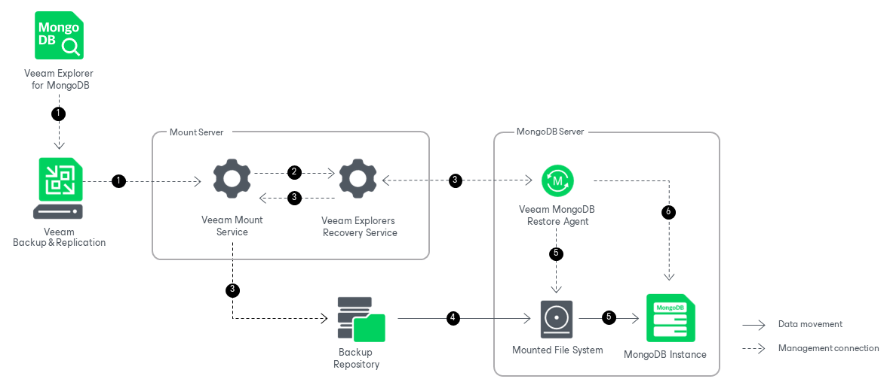

# How Restore Works

Restoring Collections

Restoring MongoDB collections with Veeam Explorer for MongoDB works in the following manner:

1. To start the restore process, Veeam Explorer for MongoDB sends a restore command to the Veeam Mount Service. The service runs on the mount server associated with the backup repository.
2. The Veeam Mount Service delegates this request to the Veeam Explorers Recovery Service running on the same server.
3. The Veeam Explorers Recovery Service uses a MongoDB driver to connect to the target MongoDB instance. The service deploys the Veeam MongoDB Restore Agent on the primary node of the target MongoDB deployment. The Veeam MongoDB Restore Agent validates the permissions of the selected user and checks if there is enough free space on the target server.

The Veeam Explorers Recovery Service sends a request to the Veeam Mount Service to connect to the backup repository and initiate the mounting operation.

1. The Veeam Mount Service uses FUSE to mount the necessary file system from the backup repository to the /run/media directory of the primary node of the target MongoDB deployment.
2. The Veeam MongoDB Restore Agent starts a temporary MongoDB instance from the mounted file system.
3. The Veeam MongoDB Restore Agent uses native MongoDB commands to restore the necessary collections to the target server.

1. The restore agent uses mongodump to save the necessary collections from the mounted file system to the standard output (stdout) of the target server.
2. The restore agent uses mongorestore to restore the necessary collections from the standard input (stdin) to the target location.

If you are restoring collections to a point-in-time state, the restore agent will replay the oplog entries from the backup.

Note that point-in-time restore is only available when restoring multiple collections from the replica set node or when restoring an entire instance. Point-in-time restore is not available when restoring single databases, or when restoring multiple collections from a database.

After the necessary collections are successfully restored, they are replicated to the secondary nodes of the replica set using native MongoDB functionality.

After the restore operation successfully completes, Veeam Explorer for MongoDB shuts down the temporary instance, removes Veeam MongoDB Restore Agent and unmounts the mounted file system from the target server.

Restoring Instance

Restoring the entire MongoDB instance with Veeam Explorer for MongoDB works in the following manner:

1. To start the restore process, Veeam Explorer for MongoDB sends a restore command to the Veeam Mount Service. The service runs on the mount server associated with the backup repository.
2. The Veeam Mount Service delegates this request to the Veeam Explorers Recovery Service running on the same server.
3. The Veeam Explorers Recovery Service deploys the Veeam MongoDB Restore Agent on the target MongoDB server. The Veeam MongoDB Restore Agent validates the permissions of the selected user and checks if there is enough free space on the target server.

The Veeam Explorers Recovery Service sends a request to the Veeam Mount Service to connect to the backup repository and initiate the mounting operation.

1. The Veeam Mount Service uses FUSE to mount the necessary file system from the backup repository to the /run/media directory of the target MongoDB server.
2. The Veeam MongoDB Restore Agent copies the entire instance to the specified data folder on the target MongoDB server.
3. The Veeam MongoDB Restore Agent starts the new instance. If you are restoring the instance to a point-in-time state, the restore agent will replay the oplog entries from the backup.

Note that restoring an entire MongoDB instance does not preserve replica set infrastructure. For more information on how to redeploy the replica set, see the [MongoDB Manual](https://www.mongodb.com/docs/manual/tutorial/convert-standalone-to-replica-set/).

After the restore operation successfully completes, Veeam Explorer for MongoDB removes Veeam MongoDB Restore Agent and unmounts the mounted file system from the target server.

