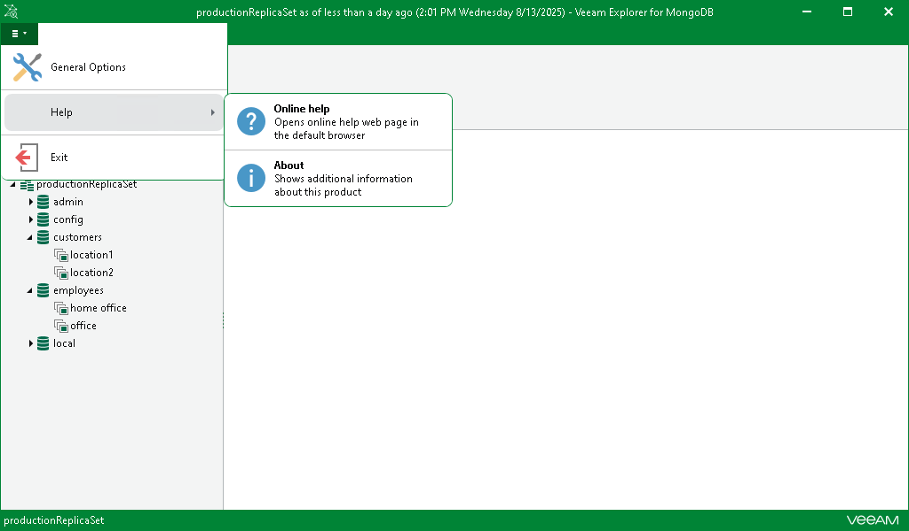
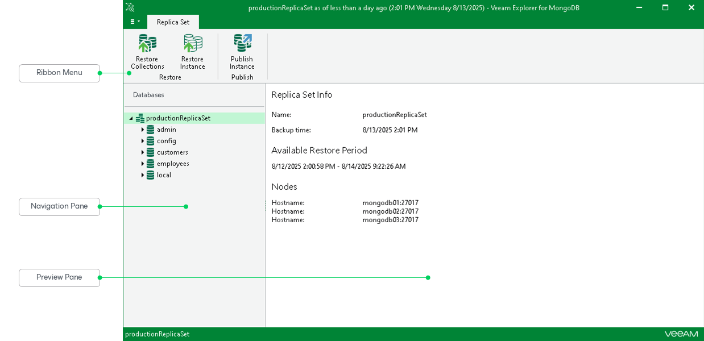

# Getting to Know User Interface

In this article

Veeam Explorer for MongoDB provides you with a convenient user interface that allows you to perform the required operations in a user-friendly manner.

Main Menu

To open the main menu, click the menu toggle in the upper-left part of the main application window.

In the main menu, you can perform the following actions:

* Click General Options to configure the general application settings.
* Hover over Help to see the Online help and About options.

* Click Online help to open the online help page.
* Click About to see additional information about Veeam Explorer for MongoDB, such as the build number.

* Click Exit to close the Veeam Explorer for MongoDB window.

|  |
| --- |
| Tip |
| To open online help, press [F1] in any Veeam Explorer for MongoDB wizard or window. You will then be redirected to the relevant section of the user guide. |

Main Application Window

The main application window contains the following UI elements:

* The ribbon menu, which contains general program commands organized into logical groups.
* The navigation pane, which allows you to browse through the hierarchy of folders with backed-up data.
* The preview pane, which shows you details about the objects you have selected in the navigation pane.

Page updated 8/14/2025

Page content applies to build 13.0.1.1071
