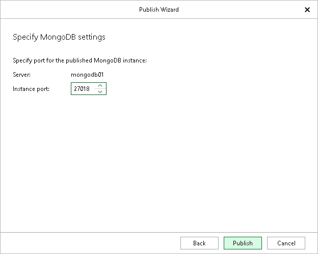

# Step 6. Specify MongoDB Settings

At this step of the wizard, specify a free MongoDB instance port in the Instance port field and click Publish.

The specified port must be free. If the port is occupied, Veeam Explorer for MongoDB will display an error.

