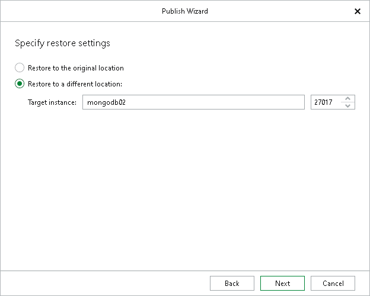

# Step 3. Specify Publishing Location

In this article

At this step of the wizard, you can choose whether to publish your MongoDB data to the original or to another replica set.

* The Restore to the original location option allows you to publish your MongoDB data to the original replica set.
* The Restore to a different location option allows you to publish your MongoDB data to another replica set.

In the Target instance field, enter the DNS name or IP address of a node of the target replica set and the port used to connect to the target MongoDB instance.

Page updated 8/28/2025

Page content applies to build 13.0.1.1071
