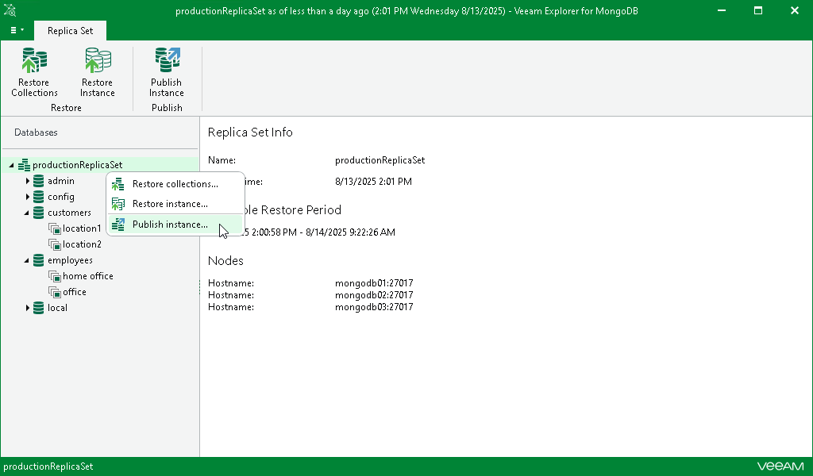

# Step 1. Launch Publish Wizard

In this article

To publish the MongoDB instance, do the following:

1. In the navigation pane, select the replica set.
2. On the Replica Set tab in the ribbon menu, select Publish Instance.

Alternatively, you can right-click the replica set in the navigation pane and select Publish instance.

Page updated 8/27/2025

Page content applies to build 13.0.1.1071
