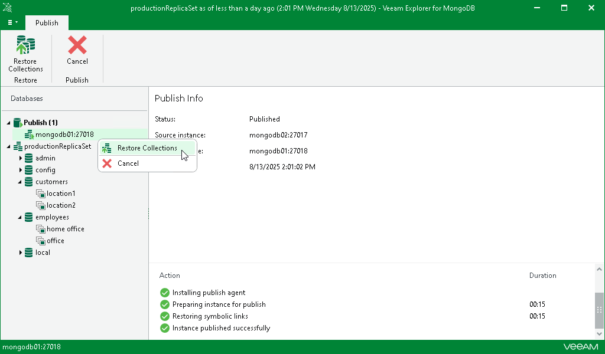
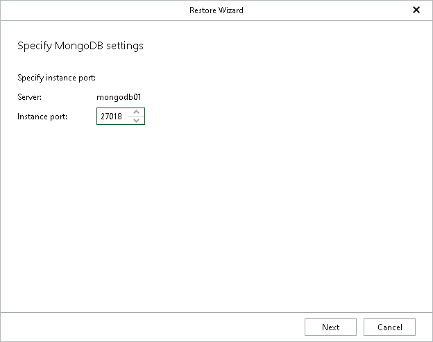

# Restoring from Published Instances

Veeam Explorer for MongoDB allows you to restore collections from published MongoDB instances. This feature restores the modified collections managed by the instance, preserving all the changes that have been made during the publishing session. The collections will be restored to the point-in-time state selected in the [Specify Restore Point](vemdb_rs_publish_instance_specify_restore_point.md) step of the Publish Wizard.

|  |
| --- |
| Note |
| You can restore collections from published instances only if the instance is published on the primary node of the target replica set. |

To restore databases from the published instance, do the following:

1. In the navigation pane, under the Publish node, select a published instance.
2. On the Publish tab in the ribbon menu, select Restore Collections. You can also right-click the published instance and select Restore Collections.

1. At the Specify MongoDB Settings step of the Restore Wizard, specify the port of the instance to which you want to restore your collections.

1. Proceed with the [Specify Replica Set Credentials](vemdb_rs_restore_collection_multiple_specify_rs_credentials.md) step of the Restore Wizard. Complete the remaining steps of the wizard to restore your collections.

