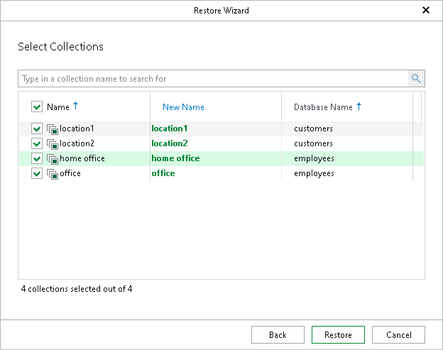

# Step 7. Select Collections

In this article

At this step of the wizard, select the collections that you want to recover and click Restore.

To quickly find the necessary collections, use the search field or sort the collections by their name or the names of the databases to which they belong.

In the New Name column, you can specify new names for the selected collections on the target server. If the renamed collections do not exist on the target server, they will be created.

If collections with the same names exist on the target MongoDB machine, you will be prompted to overwrite them before the restore session starts.

|  |
| --- |
| Note |
| Consider the following:   * You cannot restore system collections from the config and local databases to the target database with the original names. To restore these collections, you must first rename them. * The collections stored in the admin database will be restored with their original names. |

Page updated 11/4/2025

Page content applies to build 13.0.1.1071
