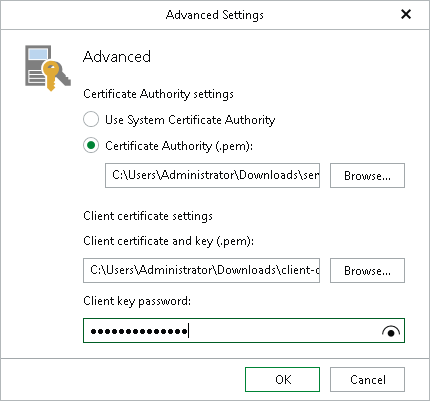
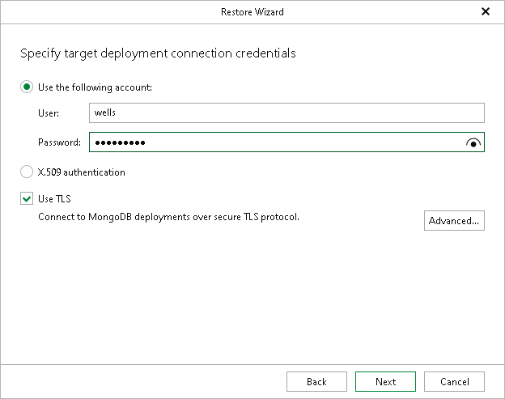

# Step 4. Specify Replica Set Credentials

At this step of the wizard, specify the connection parameters for the target MongoDB replica set. Veeam Explorer for MongoDB must access the target replica set to detect the primary node.

1. Select Use the following account to use password-based SCRAM authentication:

1. In the User field, specify a root MongoDB account that will be used for connecting to the target replica set.
2. In the Password field, specify the password for the root MongoDB account.

1. Select Use X.509 authentication to authenticate to the target MongoDB replica set using X.509 authentication.
2. Select the Use TLS check box to authenticate to the target MongoDB replica set using a secure TLS connection. This option is available and preselected for both authentication methods and is required if you select Use X.509 authentication.

Click Advanced to specify TLS certificate settings.

* In the Certificate Authority settings section, configure the certificate of the MongoDB deployment.

* Select Use System Certificate Authority to use the CA certificate from system certificate store of the mount server.
* Select Certificate Authority (.pem) to specify a custom PEM file.

Specify the path to the CA file, or click Browse to search file system of the machine where Veeam Explorer for MongoDB is running.

* In the Client certificate settings section, configure the certificate on the client (the machine where Veeam Explorer for MongoDB is running).

* Specify the path to the client certificate and key file in the PEM format, or click Browse to search file system of the client.
* If the PEM file is encrypted, specify the password.

Note that the certificates on the client and server must be issued by the same CA.

