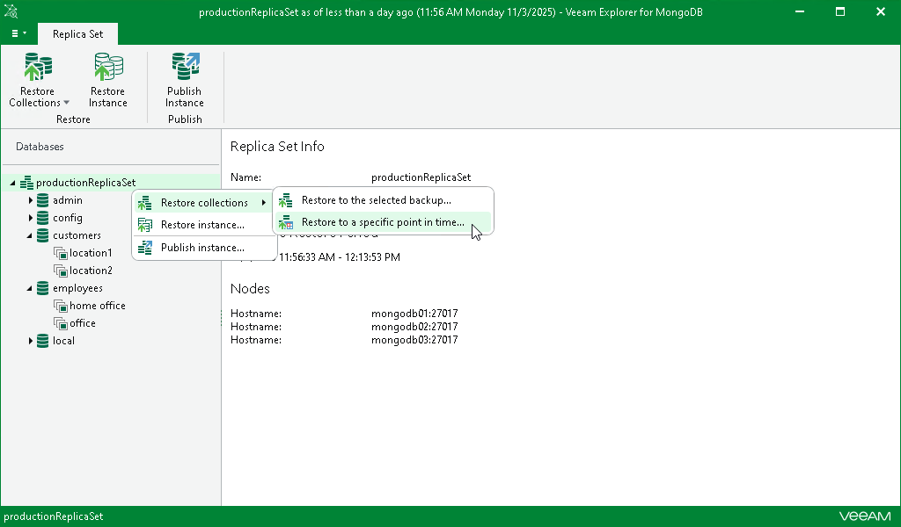

# Step 1. Launch Restore Wizard

In this article

To restore multiple collections as of a point-in-time state, do the following:

1. In the navigation pane, select the replica set.
2. On the Replica Set tab in the ribbon menu, select Restore Collections > Restore to a specific point in time.

Alternatively, you can right-click the replica set in the navigation pane and select Restore collections > Restore to a specific point in time.

Page updated 11/3/2025

Page content applies to build 13.0.1.1071
