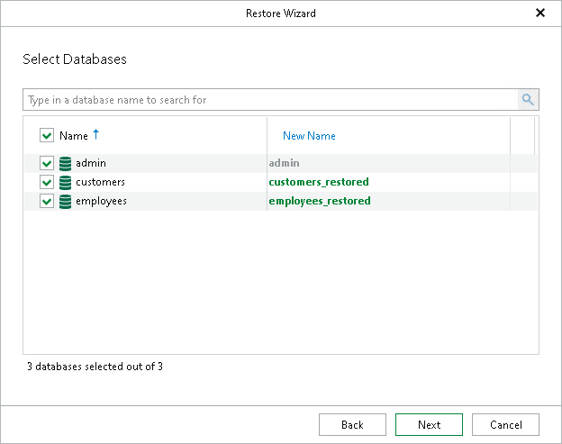

# Step 5. Select Databases

At this step of the wizard, select the databases that you want to recover.

To quickly find the necessary databases, use the search field or sort the databases by name.

In the New Name column, you can specify a new name for the selected database on the target server. If the renamed database does not exist on the target server, it will be created.

|  |
| --- |
| Note |
| Consider the following:   * When restoring the admin database to another replica set, both the source and target replica sets must have the same user. * To restore collections from the config and local databases, make sure to launch the restore wizard from the necessary database, instead of the replica set. * You cannot restore system collections from the admin, config and local databases to the original location or the equivalent databases on another server. To restore collections from these databases, specify another target database or create a new one. |

