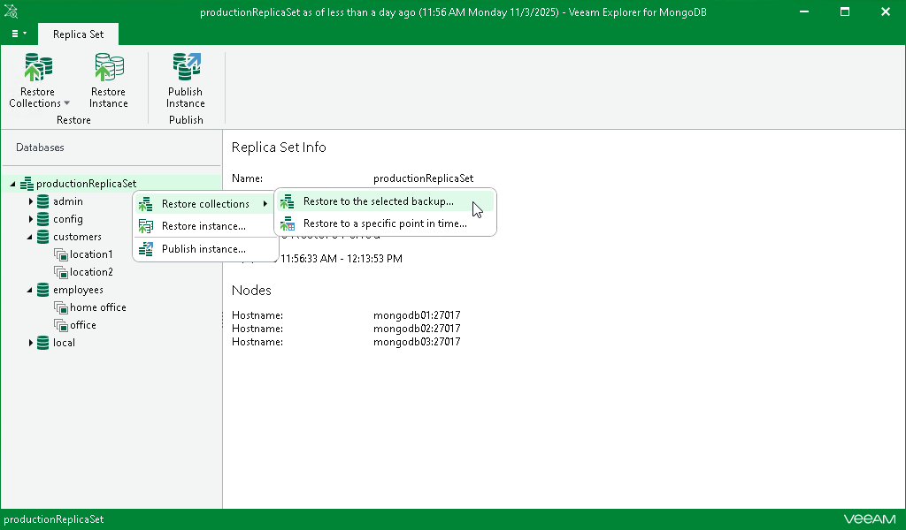

# Step 1. Launch Restore Wizard

To restore multiple collections to the latest state, perform one of the following actions:

* In the navigation pane, select a database. On the Database tab in the ribbon menu, select Restore Collections.

Alternatively, you can right-click a database in the navigation pane and select Restore collections.

* In the navigation pane, select a replica set. On the Replica Set tab in the ribbon menu, select Restore Collections > Restore to the selected backup.

Alternatively, you can right-click the replica set in the navigation pane and select Restore collections > Restore to the selected backup.

