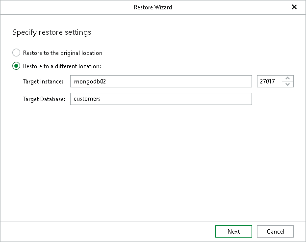

# Step 2. Specify Restore Settings

At this step of the wizard, you can choose whether to restore your MongoDB data to the original or to another replica set.

* The Restore to the original location option allows you to restore your MongoDB data to the original replica set.
* The Restore to a different location option allows you to restore your MongoDB data to another replica set.

* In the Target instance field, enter the DNS name or IP address of a node of the target replica set and the port used to connect to the target MongoDB instance.
* In the Target database field, specify the target database to which the collection will be restored.

|  |
| --- |
| Note |
| You cannot restore system collections from the admin, config and local databases to the original location or the equivalent databases on another MongoDB replica set. To restore system collections, specify a different target database or create a new one. |

