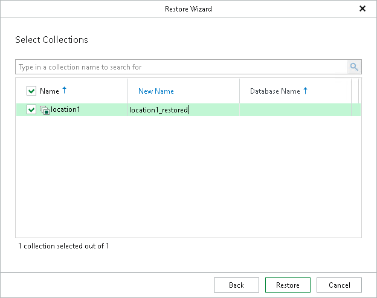

# Step 5. Specify Target Collection

At this step of the wizard, select the collection that you want to recover and click Restore.

In the New Name column, you can specify a new name for the selected collection on the target server. If the renamed collection does not exist on the target server, it will be created.

If a collection with the same name exists on the target MongoDB machine, you will be prompted to overwrite it before the restore session starts.

