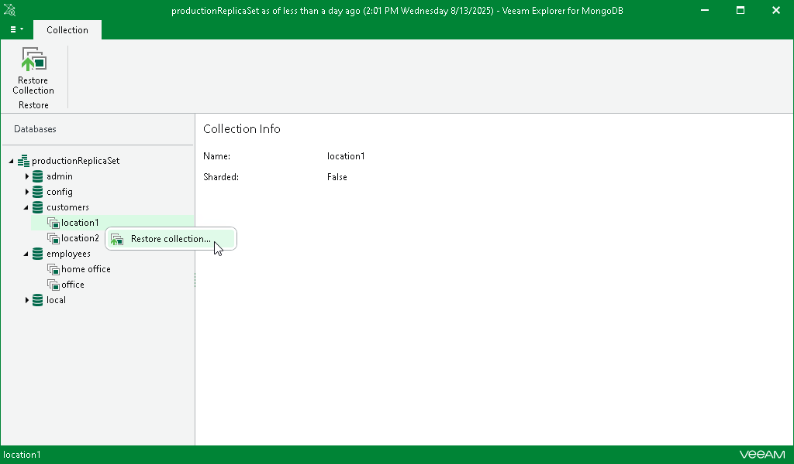

# Step 1. Launch Restore Wizard

To restore a collection, do the following:

1. In the navigation pane, select a collection.
2. On the Collection tab in the ribbon menu, select Restore Collection.

Alternatively, you can right-click a collection in the navigation pane and select Restore collection.

