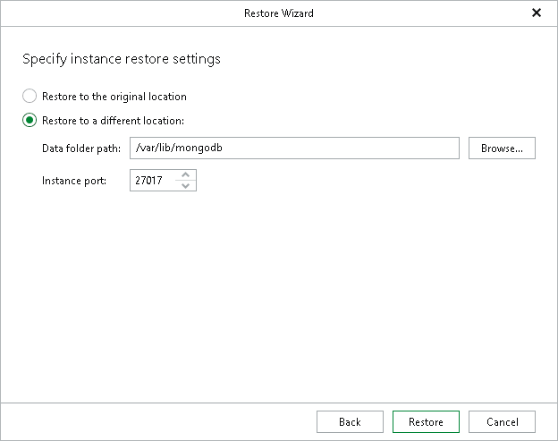

# Step 4. Specify Instance Restore Settings

In this article

At this step of the wizard, specify a location to which you want to restore the MongoDB instance.

1. Choose a location:

* Select Restore to the original location to restore the MongoDB instance to the original data folder.
* Select Restore to a different location to restore the MongoDB instance to another data folder.

* Specify the path in the Data folder path field. To locate a new folder, click Browse and select the folder you want to use.
* In the Instance port field, specify a port for the MongoDB instance. The port must be available.

1. Click Restore.

Note that if the target data folder is not empty, you will be prompted to overwrite it before the restore session starts.

Page updated 8/14/2025

Page content applies to build 13.0.1.1071
