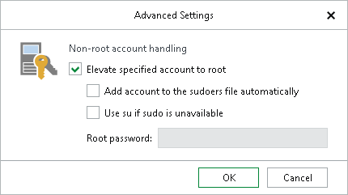

# Step 3. Specify Target Server

At this step of the wizard, specify credentials to access the target Linux machine with MongoDB.

1. In the Server field, enter the DNS name or IP address of the target server.
2. In the SSH port field, specify an SSH port (by default, port 22 is used).
3. In the Account field, specify a Linux system account name under which to connect to the specified server. This account will own all restored instance files.
4. If you have specified a non-root account that does not have root privileges on the target server, click Advanced:

1. Select the Elevate specified account to root check box.

The account must have root privileges to mount the backed-up file system to the target server and to communicate with MongoDB.

1. To add the user account to the sudoers file, select the Add account to the sudoers file automatically check box. In the Root password field, enter the password for the root account.

If you do not enable this option, you will have to manually add the user account to the sudoers file.

1. If you plan to use the account to connect to Linux servers where the sudo command is not available or may fail, you have an option to use the su command instead. To enable the su command, select the Use su if sudo is unavailable check box and in the Root password field, enter the password for the root account.

Veeam Backup & Replication will first try to use the sudo command. If the attempt fails, Veeam Backup & Replication will use the su command.

1. In the Password field, enter the account password.
2. If a private key is required to connect to the server, do the following:

1. Select the Private key is required for this connection check box.

1. In the Private key field, specify a file that contains a private key.

To locate a file, click Browse and select a key.

1. In the Passphrase field, enter the passphrase used to decrypt the private key.

