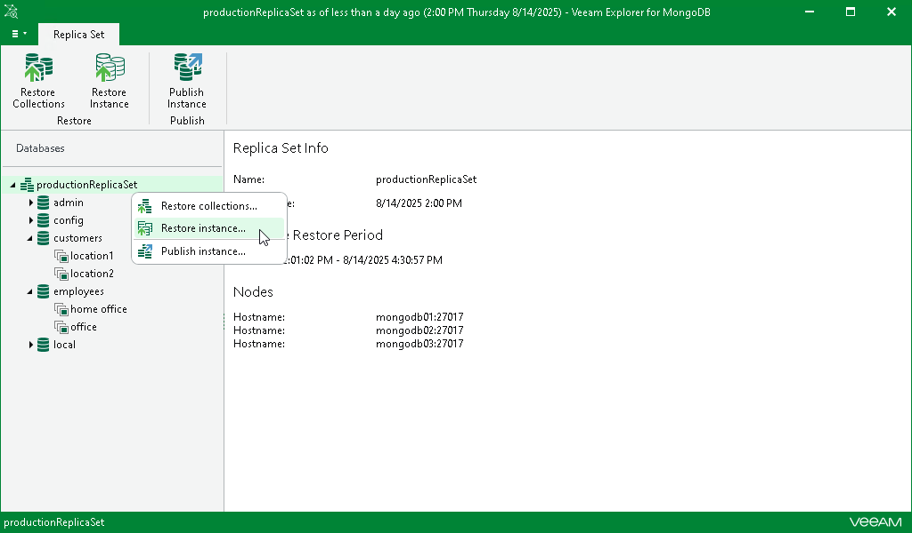

# Step 1. Launch Restore Wizard

In this article

To restore the MongoDB instance, do the following:

1. In the navigation pane, select the replica set.
2. On the Replica Set tab in the ribbon menu, select Restore Instance.

Alternatively, you can right-click the replica set in the navigation pane and select Restore Instance.

Page updated 8/27/2025

Page content applies to build 13.0.1.1071
