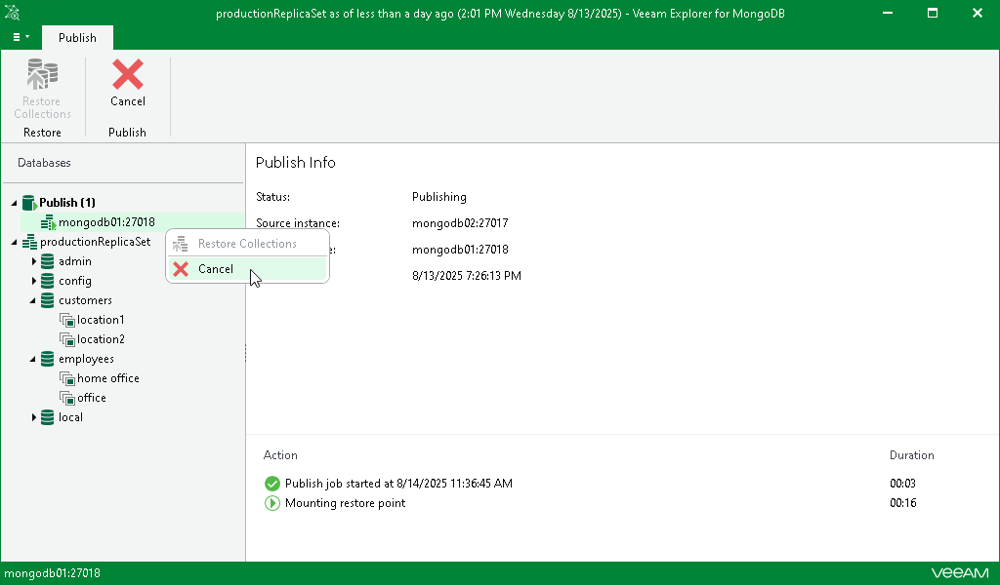

# Unpublishing Instances

In this article

Once you have finished working with published instances, you may want to unpublish (detach) these instances from the target server. This will dismount the mount points from under the /run/media directory.

To unpublish an instance manually, do the following:

1. In the navigation pane, under the Publish node, select a published instance.
2. On the Publish tab in the ribbon menu, select Cancel.

Alternatively, in the navigation pane, right-click a published database and select Cancel.

To detach more than one published instance simultaneously, right-click the root Publish node in the navigation pane and select Cancel. You can also select the root Publish node and click Cancel on the Publish tab in the ribbon menu.

Page updated 8/29/2025

Page content applies to build 13.0.1.1071
