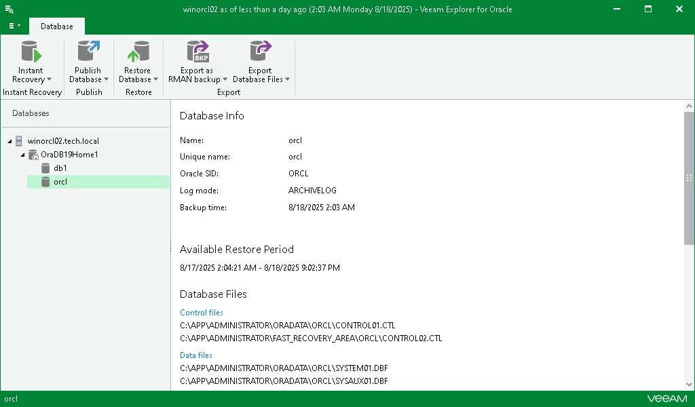
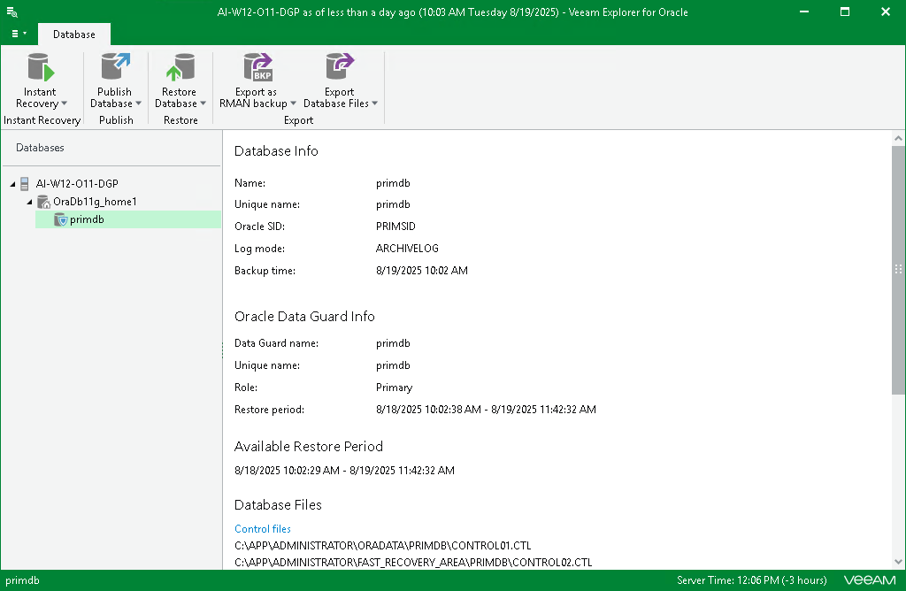
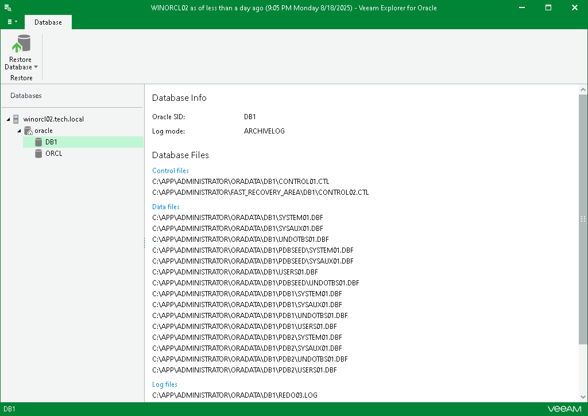

# Viewing Database Information

In this article

To view Oracle database information, select a standalone database or a Data Guard database in the navigation pane and review its properties in the preview pane.

Viewing Oracle Database Information

The following figure shows the standalone database information view.

If the current restore point was created with Oracle Automatic Storage Management (ASM), file paths will be displayed with the ‘+’ prefix.

Viewing Oracle Data Guard Information

The following figure shows the Data Guard information view.

Viewing Oracle RMAN Database Information

The following figure shows the RMAN database information view.

Page updated 8/19/2025

Page content applies to build 13.0.1.1071
