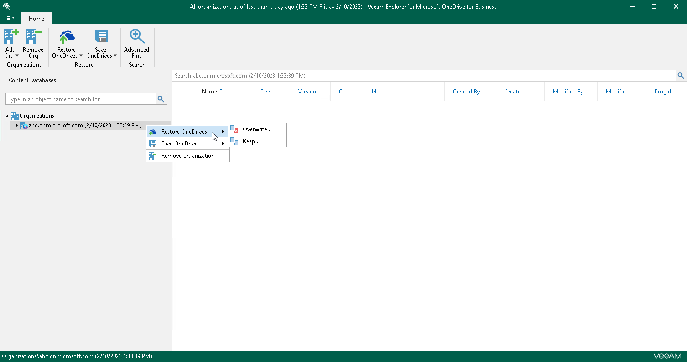

# Step 1. Launch Restore Wizard

To launch the Restore wizard, do one of the following:

* In the navigation pane, select an organization with OneDrives, and on the Home tab, click Restore OneDrives and select one of the following options:

* Overwrite — to completely overwrite existing OneDrives.
* Keep — to preserve existing data and restore items with the RESTORED prefix (RESTORED-<file\_name>.ext).

* In the navigation pane, right-click an organization with OneDrives and select Restore OneDrives > Overwrite or Restore OneDrives > Keep.

