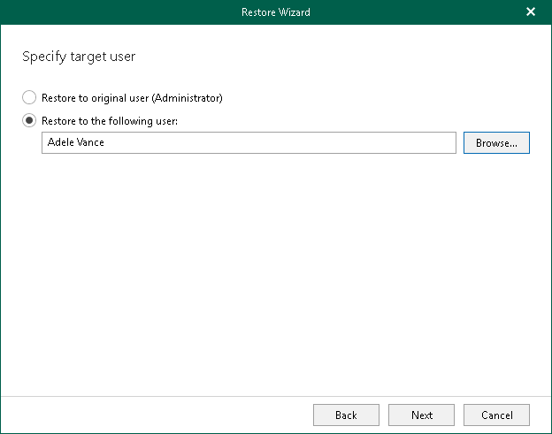

# Step 4. Specify Target User

At this step of the wizard, specify a target user where you want to copy data.

You can select one of the following options:

* Restore to original user. To copy OneDrive data back to the original user.
* Restore to the following user. To copy OneDrive data to the specified user.

To select a target user, do the following:

1. Click Browse.
2. In the Browse OneDrive Accounts window, select the necessary account and click Select.

