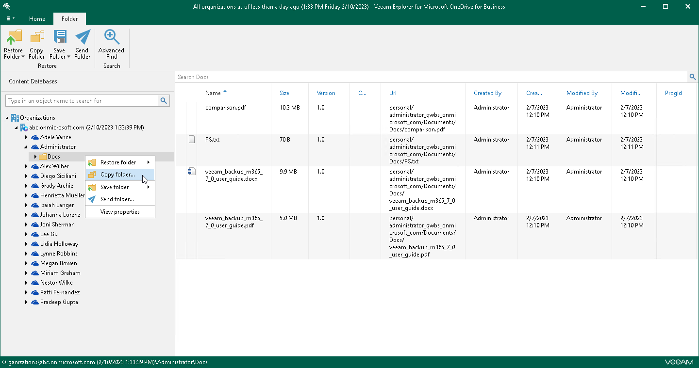

# Step 1. Launch Restore Wizard

In this article

Depending on the type of object you want to copy, to launch the Restore wizard, the following actions are available:

* To copy OneDrive, do one of the following:

* In the navigation pane, select OneDrive that you want to copy, and on the OneDrive tab, click Copy OneDrive.

* In the navigation pane, right-click OneDrive and select Copy OneDrive.

* To copy a folder, do one of the following:

* In the navigation pane, select a folder that you want to copy, and on the Folder tab, click Copy Folder.

* In the navigation pane, right-click a folder and select Copy folder.

* To copy a document, in the navigation pane, select a folder that contains the document, and then do one of the following:

* In the preview pane, select a document that you want to copy, and on the Document tab, click Copy Document.

* In the preview pane, right-click a document and select Copy document.

Page updated 9/18/2024

Page content applies to build 13.0.1.1071
