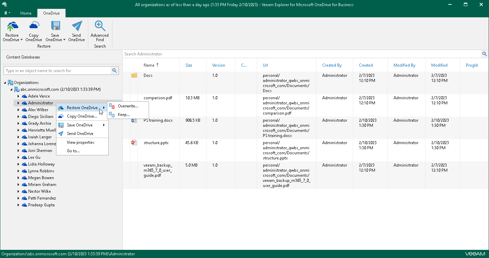

# Step 1. Launch Restore Wizard

Depending on the type of object you want to restore, to launch the Restore wizard, the following actions are available:

* To restore OneDrive, do one of the following:

* In the navigation pane, select OneDrive that you want to restore, and on the OneDrive tab, click Restore OneDrive and select one of the following options:

* Overwrite — to completely overwrite existing OneDrive data.
* Keep — to preserve existing data and restore items with the RESTORED prefix (RESTORED-<file\_name>.ext).

* In the navigation pane, right-click OneDrive and select Restore OneDrive > Overwrite or Restore OneDrive > Keep.

* To restore a folder, do one of the following:

* In the navigation pane, select a folder that you want to restore, and on the Folder tab, click Restore Folder and select one of the following options:

* Overwrite — to completely overwrite existing OneDrive data.
* Keep — to preserve existing data and restore items with the RESTORED prefix (RESTORED-<file\_name>.ext).

* In the navigation pane, right-click a folder and select Restore folder > Overwrite or Restore folder > Keep.

* To restore a document, in the navigation pane, select a folder that contains the document, and then do one of the following:

* In the preview pane, select a document that you want to restore, and on the Document tab, click Restore Document and select one of the following options:

* Overwrite — to completely overwrite existing OneDrive data.
* Keep — to preserve existing data and restore items with the RESTORED prefix (RESTORED-<file\_name>.ext).

* In the preview pane, right-click a document and select Restore document > Overwrite or Restore document > Keep.

